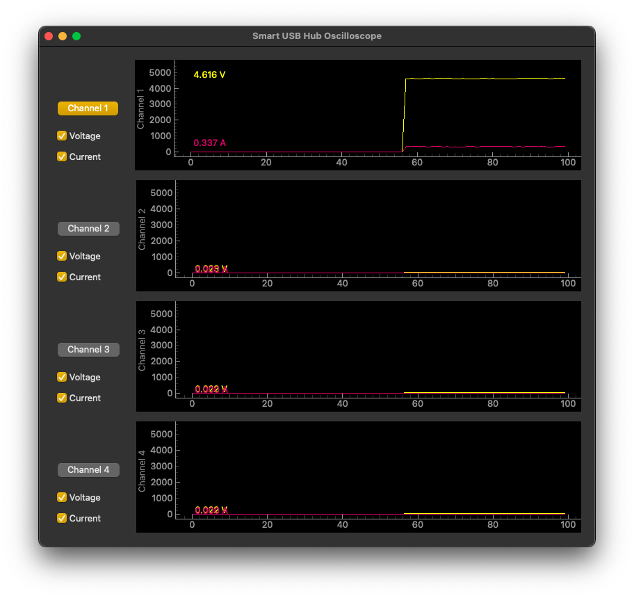

# SmartUSBHub python library
[TOC]

## 简介

smartusbhub是一个能够通过串口控制的USB2.0 4口集线器。

使用前请先了解smartusbhub，详情请阅读[设备简介](https://github.com/MrzhangF1ghter/smartusbhub/wiki/quickstart)

详情请阅读项目wiki [wiki page](https://github.com/MrzhangF1ghter/smartusbhub/wiki)

> [!NOTE]
>
> 此smartusbhub python库只是用于测试用途，如果要集成到生产环境，建议自行实现通信控制。
>
> 协议文档请查阅： [集线器协议文档](https://github.com/MrzhangF1ghter/smartusbhub/wiki/protocol)
>
> 最简单的控制demo：[simple_serial.py](./examples/simple_serial.py)


## 环境部署

### 获取最新的库

把此代码仓库克隆到本地,假设你的工程名字为`my_project`  

```shell
cd my_project
git clone https://github.com/MrzhangF1ghter/smartusbhub.git
```

库目录结构如下：

```shell
.
├── README.md					# 文档
├── examples					# 例程
├── apps							# 已经编译好的例程
├── requirements.txt	# 安装依赖
└── smartusbhub.py 		# 功能源码
```


### 设置虚拟环境

设置python虚拟环境（推荐）
`python -m venv venv`

1. 进入python虚拟环境

   - 对于Windows平台:

    `.\venv\Scripts\activate.bat`

   - 对于unix平台:

    `source ./venv/bin/activate`

2. 安装依赖库
    `pip install -r requirements.txt`

3. 将随附的数据线接到设备短边侧的<u>设备通信口</u>USB-C，另外一端接到主机的USB端口上，连接后主机将会把设备识别成:

   - Windows平台:  `COMx`
   - Linux平台: `/dev/ttyACMx`
   - mac平台: `/dev/cu.usbmodemx`


### 运行例程

`smartusbhub python library`库包含多个例程，其存放在`examples`目录下，目前有以下例子：

- `power_control_example`：展示如何控制指定通道的电源
- `dataline_control_example`：展示如何控制指定通道的数据线通断（保持电源供电）
- `voltage_monitor_example`：展示如何获取指定通道的电压值
- `current_monitor_example`：展示如何获取指定通道的电流值
- `setting_example`:展示如何配置设置项
- `user_callback_example`：展示如何添加用户回调
- `oscilloscope`：一个简单的GUI示波器，可控制通道电源开关、电压及电流采集



<center>图：示波器demo</center>


若要运行demo，请执行以下指令：

- 激活虚拟环境：

  - Linux/macOS用户：

    ```
     source ./venv/bin/activate
    ```

  - Windows 用户：

    ```shell
    .\venv\Scripts\activate.bat
    ```

- 进入examples文件夹：

  ```
  cd ./examples/
  ```

- 运行demo，例如：

  ```shell
  python oscilloscope.py
  ```

  

### 集成到你的项目中

通过导入smartusbhub库即可即成到你的项目之中。

1. 按照前面的章节 *使用方法*配置: 步骤 1 到 5.

2. 导入`smartusbhub`库到你的工程.

   ```python
   import sys
   sys.path.append('../')
   from smartusbhub import SmartUSBHub
   ```

3. 初始化`SmartUSBhub`实例:

   - 通过自动扫描连接设备：

     ```python
     hub = SmartUSBHub.scan_and_connect()
     ```

   - 通过指定串口号连接设备：

     ```python
     hub = SmartUSBHub("串口路径")
     例子：
     hub = SmartUSBHub("/dev/cu.usbmodem132301")
     ```


## **用户接口**

### 设备连接

#### `scan_and_connect()`

- **描述**: 扫描可用的 Smart USB Hub 设备，并连接到第一个有效设备。
- **返回值**:
  - SmartUSBHub 实例（如果找到设备），否则返回 `None`。

- **示例**:
  ```python
  hub = SmartUSBHub.scan_and_connect()
  ```

#### `connect(port)`

- **描述**: 连接到指定的Smart USB Hub 设备。

- 参数:

  - [port](vscode-file://vscode-app/Applications/Visual Studio Code.app/Contents/Resources/app/out/vs/code/electron-sandbox/workbench/workbench.html) (str): 要连接的串口名称。

- 示例:

  ```python
  hub.connect("/dev/cu.usbmodem132301")
  ```


### 控制通道电源开关

#### `set_channel_power(*channels, state)`

- **描述**: 设置指定通道的电源状态。
- **参数**:
  - `*channels` (int): 要控制的通道。
  - state (int): `1` 开启电源，`0` 关闭电源。

- **示例**:
  
  ```python
  hub.set_channel_power(1, 2, state=1)
  ```


### 获取通道电源状态

#### `get_channel_power_status(*channels)`

- **描述**: 查询指定通道的电源状态。
- **参数**:
  
  - `*channels` (int): 要查询的通道。
- **返回值**:
  - `dict` 或 `int` 或 `None`: 如果查询多个通道，返回包含通道状态的字典；如果查询单个通道，返回该通道的状态；若超时则返回 `None`。
- **示例**:
  ```python
  status = hub.get_channel_power_status(1, 2)
  ```


### 控制通道电源互锁

#### `set_channel_power_interlock(channel)`

- **描述**: 设置指定通道或所有通道的互锁模式。
- **参数**:
  - channel (int 或 `None`): 要设置的通道。如果为 `None`，则关闭所有通道。

- **返回值**:
  - bool: 如果命令被确认返回 `True`，否则返回 `False`。

- **示例**:
  
  ```python
  hub.set_channel_power_interlock(1)
  ```


### 控制通道数据开关

#### `set_channel_dataline(*channels, state)`

- **描述**: 设置指定通道的数据线状态。

- **参数**:
  - `*channels` (int): 要更新的通道。
  - state (int): `1` 连通 D+ D-的物理连接， `0` 断开D+ D-的物理连接。

- **示例**:
  
  连通 通道1的物理连接
  
  ```python
  hub.set_channel_dataline(1,state=1)
  ```
  
  
### 获取通道数据状态
#### `get_channel_dataline_status(*channels)`
- **描述**: 查询指定通道的数据线状态。
- **参数**:
  - `*channels` (int): 要查询的通道。
- **返回值**:
  - `dict` 或 `None`: 包含通道状态的字典，若超时则返回 `None`。
- **示例**:
  ```python
  status = hub.get_channel_dataline_status(1, 2)
  ```


### 获取通道电压

#### `get_channel_voltage(channel)`

- **描述**: 查询单个通道的电压。
- **参数**:
  - channel (int): 要查询的通道。

- **返回值**:
  - `int` 或 `None`: 通道的电压值，若超时则返回 `None`。
- **示例**:
  ```python
  voltage = hub.get_channel_voltage(1)
  ```
  


### 获取通道电流

#### `get_channel_current(channel)`

- **描述**: 查询单个通道的电流。
- **参数**:
  - channel (int): 要查询的通道。

- **返回值**:
  - `int` 或 `None`: 通道的电流值(mA)，若超时则返回 `None`。
- **示例**:
  ```python
  current = hub.get_channel_current(1)
  ```

### 注册用户回调

#### `register_callback(cmd, callback)`

- **描述**: 为指定的命令注册一个用户回调函数。当设备返回该命令的应答时，回调函数会被触发。

- **参数**:
  - cmd (int): 要注册回调的命令。
  - callback (function): 当命令的 ACK 被接收到时执行的回调函数。回调函数应接受两个参数：
    - channel (int): 触发回调的通道编号。
    - status (int): 通道的状态值。
  
- **返回值:**
  - 无返回值。
  
- **注意事项**:
  - 如果 cmd 不在支持的命令列表中，将记录警告日志，并不会注册回调。
  - 回调函数的签名应与设备返回的数据结构匹配。
  
- **cmd列表：**
  
  ```c
  CMD_GET_CHANNEL_POWER_STATUS = 0x00
  CMD_SET_CHANNEL_POWER = 0x01
  
  CMD_SET_CHANNEL_POWER_INTERLOCK = 0x02
  
  CMD_GET_CHANNEL_VOLTAGE = 0x03
  CMD_GET_CHANNEL_CURRENT = 0x04
  
  CMD_SET_CHANNEL_DATALINE = 0x05
  CMD_GET_CHANNEL_DATALINE_STATUS = 0x08
  
  CMD_SET_BUTTON_CONTROL = 0x09
  CMD_GET_BUTTON_CONTROL_STATUS = 0x0A
  
  CMD_SET_OPERATE_MODE = 0x06
  CMD_GET_OPERATE_MODE = 0x07
  CMD_GET_FIRMWARE_VERSION = 0xFD
  CMD_GET_HARDWARE_VERSION = 0xFE
  ```

​	


### 设置按钮控制

#### `set_button_control(enable)`

- **描述**: 启用或禁用集线器的物理按钮。
- **参数**:
  - enable (bool): `True` 启用按钮，`False` 禁用按钮。

- **示例**:
  
  ```python
  hub.set_button_control(True)
  ```


### 获取按钮控制状态

#### `get_button_control_status()`

- **描述**: 查询集线器的物理按钮是否启用。
- **返回值**:
  - `int` 或 `None`: `1` 表示启用，`0` 表示禁用，若无响应则返回 `None`。
- **示例**:
  
  ```python
  status = hub.get_button_control_status()
  ```


### 设置设备的操作模式

#### `set_operate_mode(mode)`

- **描述**: 设置设备的操作模式。
- **参数**:
  - mode (int): 操作模式（`0` 为普通模式，`1` 为互锁模式）。

- **示例**:
  ```python
  hub.set_operate_mode(0)
  ```


### 获取设备的操作模式

#### `get_operate_mode()`

- **描述**: 查询设备的当前操作模式。
- **返回值**:
  - `int` 或 `None`: 当前操作模式，若无响应则返回 `None`。
- **示例**:
  
  ```python
  mode = hub.get_operate_mode()
  ```


### 获取设备信息

#### `get_device_info()`

- **描述**: 获取集线器的 ID、硬件版本、固件版本、操作模式和按钮控制状态。
- **返回值**:
  - `dict`: 包含设备信息的字典。
- **示例**:
  ```python
  info = hub.get_device_info()
  print(info)
  ```


### 获取固件版本

#### `get_firmware_version()`

- **描述**: 查询设备的固件版本。
- **返回值**:
  - `int` 或 `None`: 固件版本，若无响应则返回 `None`。
- **示例**:
  ```python
  firmware_version = hub.get_firmware_version()
  ```


### 获取硬件版本

#### `get_hardware_version()`

- **描述**: 查询设备的硬件版本。
- **返回值**:
  - `int` 或 `None`: 硬件版本，若无响应则返回 `None`。
- **示例**:
  ```python
  hardware_version = hub.get_hardware_version()
  ```
