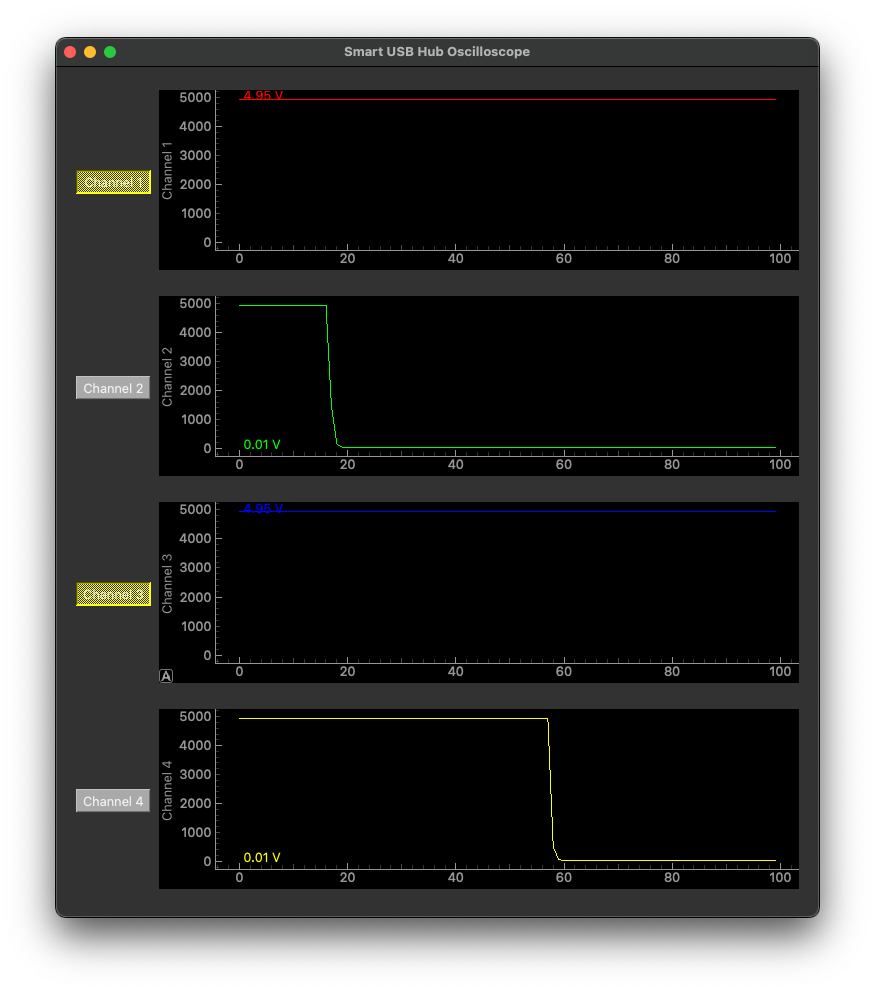

# SmartUSBHub python library
Control your usb devices connect or disconnect to the host using simple command.
For more details, please read project's [wiki page](https://github.com/MrzhangF1ghter/smartusbhub/wiki)

> [!NOTE]
>
> This smartusbhub python library is FOR TESTING PURPOSES ONLY and may contain bugs. If using it in a production environment, please refer to the [protocol documentation](https://github.com/MrzhangF1ghter/smartusbhub/wiki/protocol) to implement by your self.

## How to use

1. Clone this repository to your computer
   `git clone https://github.com/MrzhangF1ghter/smartusbhub.git`

2. Setup python virtual environment (recommend)
   `cd ./smartusbhub
   python -m venv venv`

3. Enter virtual environments

   - For Windows users:

     `.\venv\Scripts\activate.bat`

   - For Linux and MacOS users:

     `source ./venv/bin/activate`

   - Install `pyserial` library 

     `pip install pyserial`

4. Connect your smartusbhub comunication port (left-side) to your computer and Look up device comunication port name:

   - For Windows users:  `COMx`
   - For Linux users: `/dev/ttyACMx`
   - For macOS users: `/dev/cu.usbmodemx`

5. Run test.py for fun! 

   `python .\test.py -p COM3`
   
   **Command-Line Arguments**:
   
   --port: Specify the serial port for connecting to the USB hub (e.g., /dev/ttyUSB0).
   
   The script will:
   
   - Continuously toggle each channel, check its state, and print it.
   
   - Demonstrate multi-channel control by toggling groups of channels.


## Integrate to your project

You can intergrate in your project by importing smartusbhub library.

1. Follow chapter *How to use*: step 1 to 3.

2. Install smartusbhub library

    `pip install ./smartusbhub` 

3. Import smartusbhub into your project.

   ```python
   from smartusbhub import *
   ```

4. Initialize SmartUSBhub instance:

   ```python
   hub = SmartUSBHub(port="/dev/cu.usbmodemxxx")
   ```

5. now you can control your smartusbhub!

**key Methods:**

`control_channel(state, *channels)`: Turn specified channels ON or OFF.

`get_channel_status(*channels)`: get the level status of specified channels (ON/OFF).

`interlock_control(state, channel)`: Set a specific channel in interlock mode.

`set_mode_normal() and set_mode_interlock()`: Switch between normal and interlock modes.

`get_mode()`: Retrieve the current mode of the device.

`close()`: Close the device connection.

## demos

### oscilloscope

There is an oscilloscope demo apps that can control each channel on/off and monitor channel's output voltage.

You can control channel by pressing the button on the left side.

```shell
python oscilloscope.py -p /dev/cu.usbmodemxxx
```


