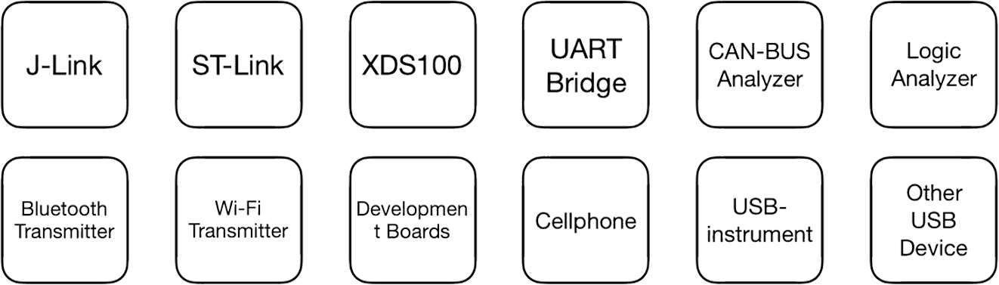

# **Smart USB Hub User Guide**

[简体中文](./智能USB集线器_使用指南.md)

**This document applies to model:** SmartUSBHub_V1.3a

**Last updated on:** June 24, 2025


## **Key Features**

The Smart USB Hub offers per-port power and data control, voltage/current sensing, and manual plug/unplug simulation—designed for development, testing, and device management.

1. **Standard USB 2.0 Data Transfer**: Utilizes a USB 2.0 hub chip with MTT technology. Each port supports up to 480 Mbps (USB 2.0 high-speed), allowing it to function as a normal USB hub.

2. **Programmable USB Port Switching**

   - Independently control **VBUS power** and **D+/D− data lines** for each downstream port
   - Simulates manual hot-plug behavior via button or serial command

3. **Integrated Voltage and Current Monitoring**

   - Each port supports real-time sensing of **voltage** and **current** for power analysis and device diagnostics

4. **Software-Controllable & Multi-Platform Compatible**

   - USB CDC-based serial command interface, provide Python libraries for quick control
   - Supports on Windows, macOS, Linux platforms, no need additional drivers

5. **Dual Operating Modes**

   - **Normal Mode**: all ports can operate independently
   - **Interlock Mode**: only one port is active at a time
   - Each port supports customizable **power-on defaults** and **power-loss state retention**

6. **Robust Hardware Interfaces**

   - 1x USB-C upstream, 4x USB-A USB2.0 downstream, 1x serial command port, 1x auxiliary power input
   - Supports up to 5V 4A per port, with overvoltage, overcurrent, reverse current, and ESD protection

7. **Topology Support for Scalable Deployment**

   - Supports hierarchical topologies with data/command port aggregation
   - Each hub can be assigned a unique address for large-scale setups

8. **Upgradeable and Secure**

   - OTA firmware upgrade support
   - Access control features planned for future firmware releases


## Trusted by Industry Leaders

*From consumer electronics to autonomous driving, from global smartphone leaders to high-performance chip design companies, SmartUSBHub is widely deployed in the R&D, automated testing, and production validation flows of top-tier enterprises.*

SmartUSBHub is now used by **20+ global industry leaders**, Representative use cases include:

- **Automotive Industry:** Used by over 3 of the global top 5 Tier 1 suppliers.
- **Smartphone:** Used by over 3 of the top 5 global smartphone OEMs.
- **Semiconductors & Chip Design:** Deployed by over 5 leading chip design companies worldwide.
- **AI & Large Model Platforms:** Integrated into internal testing flows of at least 2 global AI tech giants.
- **Telecom & IoT Equipment:** Adopted at scale by multiple leading global and regional vendors.


## **Application Scenarios**

### Embedded System Debugging

- **Precise USB Enumeration Control:** Scripted USB port toggling allows for predefined enumeration sequences, ensuring key devices are recognized first in multi-device systems, enhancing repeatability in testing and predictability in boot processes.
- **Remote Debugging & Reset:** Engineers frequently unplug and replug debug tools (e.g., J-Link) or USB devices to reset embedded targets. SmartUSBHub enables remote control of USB power and data, simulating plug/unplug events to reboot hung devices or trigger bootloader modes—particularly useful in unattended lab setups.
- **Power Monitoring & Fault Diagnosis:** Real-time voltage and current monitoring helps detect issues such as sudden power loss or abnormal current draw. Engineers can identify hardware faults early by correlating power anomalies with test failures.

### Automated Validation Testing

- **Reliability Testing:** SmartUSBHub can repeatedly toggle power and data lines to simulate plug/unplug and power loss scenarios, validating USB port resilience and firmware stability under stress (e.g., interrupted flash writes). No physical intervention is needed.
- **Power Profiling:** Real-time logging of per-port voltage and current during automated test cases enables correlation with device behavior. Engineers can validate power consumption during standby and active modes, spotting overdraw or leakage issues.
- **Test System Integration:** The Python API and serial command interface allow seamless integration into ATEs. Engineers can perform parallel or sequential control over multiple USB devices for batch reboots or firmware updates, improving test coverage and throughput.

### Production Line Testing

- **Boost Production Throughput:** SmartUSBHub allows multiple DUTs to be tested simultaneously via software-controlled port toggling, eliminating the need for manual reconnection and increasing testing speed and efficiency.
- **Automated Firmware Flash & Reboot:** Automated workflows can use SmartUSBHub to sequentially toggle USB data lines for firmware flashing, then power-cycle each device remotely. This reduces manual errors and ensures consistent execution across batches.
- **Electrical Parameter Checks:** Per-port current monitoring enables the system to flag short circuits or overcurrent conditions, helping to isolate defective units in real-time.

### USB Asset Management

- **Secure Peripheral Authorization:** Control connections to sensitive devices like dongles, e-signature tokens, and tax UKeys, enabling physical-layer enable/disable logic for security-critical scenarios.
- **Peripheral Switching in Shared Environments:** Manage USB peripherals like cameras, microphones, and KVMs in meeting rooms or data centers from a central controller.
- **Hardware-Level Isolation & Auditability:** Ideal for finance and government sectors where physical USB disconnection is required for compliance or data security. Enables physical-layer access control and USB event traceability.


## **Device Overview**


## **Connection Guide**


## **Device Interfaces**

- **Command Port** (×1): Used for sending/receiving control commands (connects to host).

- **Auxiliary Power Port** (×1): Connect an external power supply to this port when downstream devices require higher power.
- **USB Upstream Port** (×1): Port for connecting to a USB host.
- **USB Downstream Ports** (×4): Ports for connecting USB devices.


**[1] Button(s)**:

> **Single click**: Toggle the corresponding channel on/off.
>
> **Long press**:
>
> - [Button 1] For 3 seconds: Switch operating mode (Normal/Interlock).
>
> - [Button 1] For 6 seconds: Restore factory settings.
>
> - [Button 2] For 3 seconds: Enable/disable power-loss state Persistence feature.


**[2] Channel Indicator LEDs**:

> On: Channel is ON.
>
> Off: Channel is OFF.


**[3] Status Indicator LED**:

> Slow flash: Normal mode.
>
> Fast flash: Interlock mode.


**[4] Auxiliary Power Port**:

> If the downstream device’s power draw exceeds 10 W (5 V 2 A), connect an external power supply to this port.
>
> Recommended max input: 30 W (5 V 6 A), *no over-current protection*.


**[5] Device Communication Port**:

> Used for control commands (connects to host).
>
> Max input: 20 W (5 V 4 A), with reverse-protection, over-voltage protection, and over-current protection.


**[6] USB 2.0 Upstream Port**:

> Provides power and data connection to a USB host (e.g., PC).
>
> Max input: 20 W (5 V 4 A), with reverse feed protection, over-voltage protection, and over-current protection.


**[7] USB 2.0 Downstream Ports**:

> USB Type-A ports with power and data, used for connecting USB devices.
>
> Max output per port: 20 W (5 V 4 A).


> [!NOTE]
>
> Connect **USB 2.0 Upstream Port [6]** to the host for data transfer, and connect **Device Communication Port [5]** for command control.
>
> In other words, if you need both data transfer and command control, connect both of these ports to the same host.


> [!WARNING]
>
> This device only supports 5V DC input. Exceeding this voltage may result in damage.  
>
> Avoid operating beyond the rated power; excessive load may cause overheating of cables or connectors and lead to device failure.


## **System Compatibility**

This device uses a standard USB CDC interface and requires no driver. Just plug and play.  It has been verified on the following systems:

- Windows 10, 11 or newer
- macOS 10.9 or newer
- Linux distributions (e.g., Ubuntu)
- Other x86, AMD64, ARM64 platforms (e.g., Apple Silicon, Windows on ARM)

> [!NOTE]
>
> For Windows 7 and earlier versions of Windows, a driver needs to be installed. The driver is located in the `windows7_xp_driver` folder.


## **USB Compatibility**

> This device complies with the USB 2.0 specification. The upstream port supports USB 2.0 High-Speed and Full-Speed. The downstream ports support USB 2.0 High-Speed (480 Mbps), Full-Speed (12 Mbps), and Low-Speed (1.5 Mbps), and are backward compatible with USB 1.1.
>
> Supports high-performance MTT mode (4 transaction translators, one per port, for concurrent processing), giving each port an independent transaction translator and achieving full-bandwidth parallel transfers—total bandwidth is four times that of STT mode.


**Compatible with all USB devices (no picky device compatibility).**


### **Common Devices**



| **Verified Devices**                                         | **Name**                                            |
| ------------------------------------------------------------ | --------------------------------------------------- |
|  | Keyboard, mouse and other input devices             |
|  | USB flash drive                                     |
|  | External hard drive                                 |
|  | CA certificate dongle, digital signature device     |
|  | iPhone                                              |
|    | iPad                                                |
|      | Other smartphones, tablets                          |
|      | USB webcam / microphone / audio interface           |
|  | Various USB CDC devices (e.g., industrial, printer) |


### **Devices Requiring USB Power**

> SmartUSB hub supports any powered device with current consumption under 4 A.

| **Verified Devices**                                         | **Name**                                    |
| ------------------------------------------------------------ | ------------------------------------------- |
|      | USB fan                                     |
|    | Water pump                                  |
|  | Xiaomi monitor light, BenQ ScreenBar series |
|      | USB LED strip                               |
|  | USB speaker                                 |


### **Development Tools**

| **Verified Devices**                                         | **Name**                                  |
| ------------------------------------------------------------ | ----------------------------------------- |
|  | Segger J-Link                             |
|  | ST-Link                                   |
|  | XDS-110                                   |
|  | XDS-100                                   |
|  | DAP-LINK                                  |
|  | USB-to-CAN adapter                        |
|  | Logic analyzer                            |
|  | USB serial bridge                         |
|  | USB dongle (hardware key)                 |
|  | Various development boards and prototypes |
|  | Raspberry Pi                              |
|  | Instruments with USB interface            |

> [!WARNING]
>
> Does not support fast-charging protocols; when a phone or tablet is connected, the charging current will be the same as if it were connected directly to a computer.

------


## **Device Specifications**

### **Dimensions**

10.6 × 4.6 × 1.8 cm (L × W × H)


### **Electrical Specifications**

- **Input Voltage**: DC 5 V
- **Max Input Current**: 16 A
- **Max Output Current**: 4 A per channel
- **Control Methods**: Button control, Command control
- **Power Supply**: Bus-powered from host or via auxiliary power port


### **Interfaces**

- **Control Interface**: USB (non-TTL signal, internally converted to USB serial)
- **Upstream Interface**: 1 × USB-C port
- **Downstream Interface**: 4 × USB-A ports
- **Auxiliary Power Interface**: 1 × USB-C port


### **Protection Features**

- **Over-Current Protection**: Upstream, communication, and each downstream port have a self-resetting 4 A fuse; auxiliary power port has no OCP fuse.
- **Over-Voltage Protection**: Upstream and communication ports have over-voltage protection.
- **Reverse Current Protection**: Upstream, communication, and auxiliary power ports have reverse current (backfeed) protection; downstream ports have no backfeed protection.
- **ESD Protection**: Critical interfaces are protected with ESD components.


## **Device Block Diagram**


## **Indicator Lights**

**There is an indicator LED on the far left of the device.**


**Indicator patterns:**

| **Blink Pattern**              | **Meaning**                       |
| ------------------------------ | --------------------------------- |
| 0.5 s on, 0.5 s off            | Normal operating mode             |
| 0.25 s on, 0.25 s off          | Channel interlock mode            |
| Momentary off flash (overlaid) | Receiving a control command frame |


## **Buttons**

**The device has 4 buttons corresponding to the 4 USB-A channels. The following special functions are available:**

| **Operation**                     | **Function**                                                 | **Default** |
| --------------------------------- | ------------------------------------------------------------ | ----------- |
| Button 1 (hold while powering on) | Enter firmware upgrade mode                                  |             |
| Button 1 (long press > 6 s)       | Restore factory settings                                     |             |
| Button 1 (long press > 3 s)       | Toggle operating mode (Normal/Interlock, persists after power cycle) | Normal Mode |
| Button 2 (long press > 3 s)       | Enable/Disable power-loss state Persistence (remember channel state) | Disabled    |


## **Command Set**

**The device uses a simple request-response communication protocol for control. The available commands are:**

| **Function**                       | **CMD** | **Description**                                              |
| :--------------------------------- | ------- | ------------------------------------------------------------ |
| Control channel power              | 0x01    | Control the VBUS power state of a specified channel          |
| Query channel power state          | 0x00    | Query whether a channel’s VBUS power is on                   |
| Control power in interlock mode    | 0x02    | In interlock mode, only allow one channel on at a time       |
| Query voltage                      | 0x03    | Query the channel’s VBUS voltage (unit: mV)                  |
| Query current                      | 0x04    | Query the channel’s current (unit: mA)                       |
| Control USB data lines             | 0x05    | Control whether D+/D− are connected                          |
| Query USB data line status         | 0x08    | Query the current on/off status of D+/D−                     |
| Set button control permission      | 0x09    | Enable or disable the physical button control                |
| Query button control permission    | 0x0A    | Query whether button control is enabled                      |
| Set power default state            | 0x0B    | Configure the default on/off state of VBUS after power-up    |
| Query power default state          | 0x0C    | Query the channel’s power default state                      |
| Set data default state             | 0x0D    | Configure the default on/off state of D+/D− after power-up   |
| Query data default state           | 0x0E    | Query the default state of D+/D−                             |
| Set power-loss state Persistence   | 0x0F    | Enable/disable remembering channel state on power loss       |
| Query power-loss Persistence state | 0x10    | Query if power-loss state Persistence is enabled             |
| Set Device Address                 | 0x11    | Set the device address, used to identify and distinguish hubs in multi-hub setups |
| Get Device Address                 | 0x12    | Retrieve the device address, used to identify and distinguish hubs in multi-hub setups |
| Set operation mode                 | 0x06    | Switch Normal/Interlock mode                                 |
| Query operation mode               | 0x07    | Query the current operating mode                             |
| Restore factory settings           | 0xFC    | Restore factory settings                                     |
| Query firmware version             | 0xFD    | Query the device firmware version                            |
| Query hardware version             | 0xFE    | Query the current hardware version                           |


## Frame format

**The protocol frame format for control, query, interlock, and set commands is:**

| **Header1** | **Header2** | **CMD**              | **Channel No.**           | **Channel Value** | **Additional Value**               | **SUM8 Checksum**   |
| ----- | ----- | ---------------- | --------------------- | ----------- | --------------- | ----------- |
| **0x55**    | **0x5A**    | **[0x01 0x02 0x03]** | **[0x01 0x02 0x04 0x08]** | **[0x00 0x01]**   | *Present only if command has data* | **CMD + CH + data** |

**The protocol frame format for reading channel voltage or current is:**

| **Header1** | **Header2** | **CMD**              | **Channel No.**           | **Value [15:8] (MSB)** | **Value [7:0] (LSB)** | **SUM8 Checksum** |
| ----------- | ----------- | -------------------- | ------------------------- | ---------------------- | --------------------- | ----------------- |
| **0x55**    | **0x5A**    | **[0x01 0x02 0x03]** | **[0x01 0x02 0x04 0x08]** | **MSB**                | **LSB**               | **CMD+CH+VAL**    |


| **Header1** | **Header2** | **CMD**                  | DATA[1-3]                       | **SUM8 校验和**  |
| ----------- | ----------- | ------------------------ | ------------------------------- | ---------------- |
| 0x55        | 0x5A        | Refer to the command set | depends on the specific command | CMD+CH+data[1-3] |


## **Command Examples**

> [!NOTE]
>
> - All data values below are in hexadecimal.
> - Channel values use the `Channel_e` enum, not the channel number. In control and query commands, bitwise OR can be used for batch control and query; if the device is in *interlock* mode, only the `interlock control command [0x02]` can be used for control; bitwise combination is ineffective.
> - Frames with an incorrect format or unsupported commands will not receive a response.
> - When a button is pressed, a `status report [0x00] command` of that channel’s current state will be sent.
> - The provided package includes a UART assistant tool (uart_tool) for quick start.
> - A Python control library [smartusbhub](https://github.com/MrzhangF1ghter/smartusbhub) is available.
> - In this document, USB downstream port is referred to simply as a channel.


**Channel Enum Values (Channel_e):**

```c
typedef enum
{
    CH1 = 0x01,
    CH2 = 0x02,
    CH3 = 0x04,
    CH4 = 0x08, 
}Channel_e;

```
> [!NOTE]
>
> **Device Communication Parameters:**
>
> - Baud Rate: 115200 – 921600 (Default: `115200`)
>
> - Data Bits: `8`
>
> - Parity: `None`
>
> - Stop Bits: `1`
>
> **Device Name:**
>
> - Windows: `COMx`
>
> - Linux: `/dev/ttyACMx`
>
> - macOS: `/dev/cu.usbmodemx`


------


### **Control Channel Power Switch (CMD: 0x01)**

> [!NOTE]
>
> If the device is in interlock mode, the normal control command (CMD: 0x01) is ineffective; you must use the interlock control command (CMD: 0x02) instead.
>
> If a control command is sent in interlock mode, an “invalid command” frame will be returned:
>
> *Invalid Command:*
>
> ```
> 55 5A 01 FF FF FF 
> ```

#### **Data Field Description:**

| data[0]     | data[1]             |
| ----------- | ------------------- |
| Channel ID  | Channel Power State |
| `Channel_e` | 0 (OFF), 1 (ON)     |


#### **Turn On Channel 1 Power**

**Command**:

```
55 5A 01 01 01 03
```

**Response**:

```
55 5A 01 01 01 03
```

#### **Turn Off Channel 1 Power**

**Command**:

```
55 5A 01 01 00 02
```

**Response**:

```
55 5A 01 01 00 02
```


#### **Turn On Channel 2 Power**

**Command**:

```
55 5A 01 02 01 04
```

**Response**:

```
55 5A 01 02 01 04
```

#### **Turn Off Channel 2 Power**

**Command**:

```
55 5A 01 02 00 03
```

**Response**:

```
55 5A 01 02 00 03
```


#### **Turn On Channel 3 Power**

**Command**:

```
55 5A 01 04 01 06
```

**Response**:

```
55 5A 01 04 01 06
```

#### **Turn Off Channel 3 Power**

**Command**:

```
55 5A 01 04 00 05
```

**Response**:

```
55 5A 01 04 00 05
```


#### **Turn On Channel 4 Power**

**Command**:

```
55 5A 01 08 01 0A
```

**Response**:

```
55 5A 01 08 01 0A
```

#### **Turn Off Channel 4 Power**

**Command**:

```
55 5A 01 08 00 09
```

**Response**:

```
55 5A 01 08 00 09
```


#### **Combined Control Example**

##### **Turn On Channel 1 and Channel 3 Power**

**Command**:

```
55 5A 01 05 01 07
```

**Response**:

```
55 5A 01 05 01 07
```

##### **Turn Off Channel 1 and Channel 3 Power**

**Command**:

```
55 5A 01 05 00 06
```

**Response**:

```
55 5A 01 05 00 06
```

##### **Turn On All Channels**

**Command**:

```
55 5A 01 0F 01 11
```

**Response**:

```
55 5A 01 0F 01 11
```

##### **Turn Off All Channels**

**Command**:

```
55 5A 01 0F 00 10
```

**Response**:

```
55 5A 01 0F 00 10
```


### **Query Channel Power State (CMD: 0x00)**

#### **Data Field Description:**

| data[0]     | data[1]             |
| ----------- | ------------------- |
| Channel ID  | Channel Power State |
| `Channel_e` | 0 (OFF), 1 (ON)     |


#### **Query Channel 1 Power State**

**Command**:

```
55 5A 00 01 00 01
```

**Response**:

**If channel 1 power is OFF**:

```
55 5A 00 01 00 01
```

**If channel 1 power is ON**:

```
55 5A 00 01 01 02
```


#### **Query Channel 2 Power State**

**Command**:

```
55 5A 00 02 00 02
```

**Response**:

**If channel 2 power is OFF**:

```
55 5A 00 02 00 02
```

**If channel 2 power is ON**:

```
55 5A 00 02 01 03
```


#### **Query Channel 3 Power State**

**Command**:

```
55 5A 00 04 00 04
```

**Response**:

**If channel 3 power is OFF**:

```
55 5A 00 04 00 04
```

**If channel 3 power is ON**:

```
55 5A 00 04 01 05
```


#### **Query Channel 4 Power State**

**Command**:

```
55 5A 00 08 00 08
```

**Response**:

**If channel 4 power is OFF**:

```
55 5A 00 08 00 08
```

**If channel 4 power is ON**:

```
55 5A 00 08 01 09
```


#### **Combined Control Example**:

##### **Query All Channels’ Power States**

**Command**:

```
55 5A 00 0F 00 0F
```

**Response**:

```
55 5A 00 01 01 02 
55 5A 00 02 00 02 
55 5A 00 04 00 04 
55 5A 00 08 01 09 
```

- **Channel 1 Power: ON**

- **Channel 2 Power: OFF**

- **Channel 3 Power: OFF**

- **Channel 4 Power: ON**


### **Control Channel USB Data Line Switch (CMD: 0x05)**

The device can control the connectivity of the D+ and D− differential pair for a specified channel, allowing scenarios where power is maintained but data is disconnected.

> [!NOTE]
>
> - By default, each channel’s USB data (D+/D−) lines are connected unless the user sends a control command (CMD: 0x05) to manually disconnect them.
>
> - If power-loss state Persistence is enabled, the data line on/off state will be remembered.

#### **Data Field Description:**

| data[0]     | data[1]                 |
| ----------- | ----------------------- |
| Channel ID  | Channel Data Line State |
| `Channel_e` | 0 (OFF), 1 (ON)         |


#### **Connect Channel 1 Data Lines**

**Command**:

```
55 5A 05 01 01 07
```

**Response**:

```
55 5A 05 01 01 07
```

#### **Disconnect Channel 1 Data Lines**

**Command**:

```
55 5A 05 01 00 06
```

**Response**:

```
55 5A 05 01 00 06
```


#### **Connect Channel 2 Data Lines**

**Command**:

```
55 5A 05 02 01 08
```

**Response**:

```
55 5A 05 02 01 08
```

#### **Disconnect Channel 2 Data Lines**

**Command**:

```
55 5A 05 02 00 07
```

**Response**:

```
55 5A 05 02 00 07
```


#### **Connect Channel 3 Data Lines**

**Command**:

```
55 5A 05 04 01 0A
```

**Response**:

```
55 5A 05 04 01 0A
```

#### **Disconnect Channel 3 Data Lines**

**Command**:

```
55 5A 05 04 00 09
```

**Response**:

```
55 5A 05 04 00 09
```


#### **Connect Channel 4 Data Lines**

**Command**:

```
55 5A 05 08 01 0E
```

**Response**:

```
55 5A 05 08 01 0E
```

#### **Disconnect Channel 4 Data Lines**

**Command**:

```
55 5A 05 08 00 0D
```

**Response**:

```
55 5A 05 08 00 0D
```


#### **Combined Control Example**:

##### **Connect Data Lines on All Channels**

**Command**:

```
55 5A 05 0F 01 15
```

**Response**:

```
55 5A 05 0F 01 15
```

##### **Disconnect Data Lines on All Channels**

**Command**:

```
55 5A 05 0F 00 14
```

**Response**:

```
55 5A 05 0F 00 14
```


### **Query Channel USB Data Line State (CMD: 0x08)**

#### **Data Field Description:**

| data[0]     | data[1]                 |
| ----------- | ----------------------- |
| Channel ID  | Channel Data Line State |
| `Channel_e` | 0 (OFF), 1 (ON)         |


#### **Query Channel 1 Data Line State**

**Command**:

```
55 5A 08 01 00 09
```

**Response**:

**If channel 1 data is DISCONNECTED**:

```
55 5A 08 01 00 09
```

**If channel 1 data is CONNECTED**:

```
55 5A 08 01 01 0A
```


#### **Query Channel 2 Data Line State**

**Command**:

```
55 5A 08 02 00 0A
```

**Response**:

**If channel 2 data is DISCONNECTED**:

```
55 5A 08 02 00 0A
```

**If channel 2 data is CONNECTED**:

```
55 5A 08 02 01 0B
```


#### **Query Channel 3 Data Line State**

**Command**:

```
55 5A 08 04 00 0C
```

**Response**:

**If channel 3 data is DISCONNECTED**:

```
55 5A 08 04 00 0C
```

**If channel 3 data is CONNECTED**:

```
55 5A 08 04 01 0D
```


#### **Query Channel 4 Data Line State**

**Command**:

```
55 5A 08 08 00 10
```

**Response**:

**If channel 4 data is DISCONNECTED**:

```
55 5A 08 08 00 10
```

**If channel 4 data is CONNECTED**:

```
55 5A 08 08 01 11
```


#### **Combined Control Example**:

##### **Combined Control Example: Query All Channels’ Data Line States**

**Command**:

```
55 5A 08 0F 00 17
```

**Response**:

```
55 5A 08 01 01 0A
55 5A 08 02 01 0B
55 5A 08 04 01 0D
55 5A 08 08 01 11 
```

- **Channel 1 Data: CONNECTED**

- **Channel 2 Data: CONNECTED**
- **Channel 3 Data: CONNECTED**
- **Channel 4 Data: CONNECTED**


### **Control Power in Interlock Mode (CMD: 0x02)**

**Control Truth Table:**

| **Channel 1** | **Channel 2** | **Channel 3** | **Channel 4** |
| ------------- | ------------- | ------------- | ------------- |
| Closed        | Closed        | Closed        | Closed        |
| **Open**      | Closed        | Closed        | Closed        |
| Closed        | **Open**      | Closed        | Closed        |
| Closed        | Closed        | **Open**      | Closed        |
| Closed        | Closed        | Closed        | **Open**      |

#### **Data Field Description:**

| data[0]     | data[1]             |
| ----------- | ------------------- |
| Channel ID  | Channel Power State |
| `Channel_e` | 0 (OFF), 1 (ON)     |


#### **Turn On Channel 1 Power (others off)**

**Command**:

```
55 5A 02 01 01 04
```

**Response**:

```
55 5A 02 01 01 04
```


#### **Turn On Channel 2 Power (others off)**

**Command**:

```
55 5A 02 02 01 05
```

**Response**:

```
55 5A 02 02 01 05
```


#### **Turn On Channel 3 Power (others off)**

**Command**:

```
55 5A 02 04 01 07 
```

**Response**:

```
55 5A 02 04 01 07 
```


#### **Turn On Channel 4 Power (others off)**

**Command**:

```
55 5A 02 08 01 0B
```

**Response**:

```
55 5A 02 08 01 0B
```


#### **Turn Off All Channels**

**Command**:

```
55 5A 02 0F 01 12
```

**Response**:

```
55 5A 02 0F 01 12
```


### **Query Channel Voltage (CMD: 0x03)**


> [!NOTE]
>
> - The device can measure the output voltage (VBUS) of each channel, which can be used to check if the bus is functioning normally.
> - The voltage unit is mV (millivolts).
> - Voltage resolution is 0.1 V

#### **Data Field Description:**

| data[0]     | data[1]                     | data[2]                    |
| ----------- | --------------------------- | -------------------------- |
| Channel ID  | Channel Voltage value[15:8] | Channel Voltage value[7:0] |
| `Channel_e` | -                           | -                          |


#### **Query Channel 1 Voltage**:

**Command**:

```
55 5A 03 01 00 04
```

**Response**:

```
55 5A 03 01 13 56 6D
```

**Channel 1 Voltage = 0x1356 = 4950 mV (channel ON)**


#### **Query Channel 2 Voltage**:

**Command**:

```
55 5A 03 02 00 05
```

**Response**:

```
55 5A 03 02 00 0C 11 
```

**Channel 2 Voltage = 0x000C = 12 mV (channel OFF)**


#### **Query Channel 3 Voltage**:

**Command**:

```
55 5A 03 04 00 07 
```

**Response**:

```
55 5A 03 04 00 09 10
```

**Channel 3 Voltage = 0x0009 = 9 mV (channel OFF)**


#### **Query Channel 4 Voltage**:

**Command**:

```
55 5A 03 08 00 0B  
```

**Response**:

```
55 5A 03 08 00 08 13
```

**Channel 4 Voltage = 0x0008 = 8 mV (channel OFF)**


### **Query Channel Current (CMD: 0x04)**

> [!NOTE]
>
> - The device can measure the current of each channel, which can be used to assess the device’s operating status.
> - The current unit is mA (milliamps).
> - Current resolution is 0.1 A

#### **Data Field Description:**

| data[0]     | data[1]                      | data[2]                     |
| ----------- | ---------------------------- | --------------------------- |
| Channel ID  | Channel Current value [15:8] | Channel Current value [7:0] |
| `Channel_e` | -                            | -                           |


#### **Query Channel 1 Current**:

**Command**:

```
55 5A 04 01 00 05  
```

**Response**:

```
55 5A 04 01 01 29 2F
```

**Channel 1 Current = 0x0129 = 297 mA**


#### **Query Channel 2 Current**:

**Command**:

```
55 5A 04 02 00 06  
```

**Response**:

```
55 5A 04 02 00 00 06
```

**Channel 2 Current = 0x0000 = 0 mA**


#### **Query Channel 3 Current**:

**Command**:

```
55 5A 04 04 00 08  
```

**Response**:

```
55 5A 04 04 00 00 08
```

**Channel 3 Current = 0x0000 = 0 mA**


#### **Query Channel 4 Current**:

**Command**:

```
55 5A 04 08 00 0C 
```

**Response**:

```
55 5A 04 08 00 00 0C
```

**Channel 4 Current = 0x0000  = 0ma** 


### **Set Button Control Permission (CMD: 0x09)**

> [!NOTE]
>
> - By default, the device allows channel control via the buttons.
>
> -  This setting applies to all buttons and channels.
>
> - Long-press button functions are not affected.
>
> - This setting is retained after power off.

#### **Data Field Description:**

| data[0] | data[1]               |
| ------- | --------------------- |
| Fixed   | Enable Button Control |
| 0x00    | 0 (false), 1 (true)   |


#### **Disable Control via Buttons**

**Command**:

```
55 5A 09 00 00 09
```

**Response**:

```
55 5A 09 00 00 09
```


#### **Enable Control via Buttons**

**Command**:

```
55 5A 09 00 01 0A
```

**Response**:

```
55 5A 09 00 01 0A
```


### **Query Button Control Permission (CMD: 0x0A)**

**Command**:

```
55 5A 0A 00 00 0A
```

**Response**:

**Button control enabled**:

```
55 5A 0A 00 01 0B
```

**Button control disabled**:

```
55 5A 0A 00 00 0A
```


### **Set Channel Power Default State (CMD: 0x0B)**

> [!NOTE]
>
> - When determining channel states after power-up, the default state has higher priority than the power-loss Persistence feature. If the default state feature is enabled, even if the power-loss Persistence feature is also enabled, the system on power-up will still use the default state to decide each channel’s power or data on/off status.
>- When the default state feature is disabled, the channels’ power-on state will be decided by the power-loss Persistence setting. If power-loss Persistence is also disabled (default configuration), then upon power-up all channels will default to OFF.
> - Factory default configuration: all channel power outputs are `OFF`.

#### **Data Field Description:**

| data[0]     | data[1]                    | data[2]             |
| ----------- | -------------------------- | ------------------- |
| Channel ID  | Enable Default Power State | Default Power Value |
| `Channel_e` | 0 (false), 1 (true)        | 0 (OFF), 1 (ON)     |


#### **Set Channel 1 Power Default to ON**

**Command**:

```
55 5A 0B 01 01 01 0E
```

**Response**:

```
55 5A 0B 01 01 01 0E
```


#### **Set Channel 1 Power Default to OFF**

**Command**:

```
55 5A 0B 01 01 00 0D
```

**Response**:

```
55 5A 0B 01 01 00 0D
```


#### **Set Channel 2 Power Default to ON**


**Command**:

```
55 5A 0B 02 01 01 0F
```

**Response**:

```
55 5A 0B 02 01 01 0F
```


#### **Set Channel 2 Power Default to OFF**


**Command**:

```
55 5A 0B 02 01 00 0E
```

**Response**:

```
55 5A 0B 02 01 00 0E
```


#### **Set Channel 3 Power Default to ON**


**Command**:

```
55 5A 0B 04 01 01 11
```

**Response**:

```
55 5A 0B 04 01 01 11
```


#### **Set Channel 3 Power Default to OFF**


**Command**:

```
55 5A 0B 04 00 00 0F
```

**Response**:

```
55 5A 0B 04 00 00 0F
```


#### **Set Channel 4 Power Default to ON**


**Command**:

```
55 5A 0B 08 01 01 15
```

**Response**:

```
55 5A 0B 08 01 01 15
```


#### **Set Channel 4 Power Default to OFF**


**Command**:

```
55 5A 0B 08 01 00 14
```

**Response**:

```
55 5A 0B 08 01 00 14
```


#### **Set All Channels Power Default to ON**

**Command**:

```
55 5A 0B 0F 01 01 1C
```

**Response**:

```
55 5A 0B 0F 01 01 1C
```


#### **Set All Channels Power Default to OFF**


**Command**:

```
55 5A 0B 0F 01 00 1B
```

**Response**:

```
55 5A 0B 0F 01 00 1B
```


#### **Disable Default Power State for Channel 1**

**Command**:

```
55 5A 0B 01 00 00 0C
```

**Response**:

```
55 5A 0B 01 00 00 0C
```


#### **Disable Default Power State for Channel 2**


**Command**:

```
55 5A 0B 02 00 00 0D
```

**Response**:

```
55 5A 0B 02 00 00 0D
```


#### **Disable Default Power State for Channel 3**


**Command**:

```
55 5A 0B 04 00 00 0F
```

**Response**:

```
55 5A 0B 04 00 00 0F
```


#### **Disable Default Power State for Channel 4**


**Command**:

```
55 5A 0B 08 00 00 13
```

**Response**:

```
55 5A 0B 08 00 00 13
```


#### **Disable Default Power State for All Channels**


**Command**:

```
55 5A 0B 0F 00 00 1A
```

**Response**:

```
55 5A 0B 0F 00 00 1A
```


### **Query Channel Power Default State (CMD: 0x0C)**

#### **Data Field Description:**

| data[0]     | data[1]                    | data[2]             |
| ----------- | -------------------------- | ------------------- |
| Channel ID  | Enable Default Power State | Default Power Value |
| `Channel_e` | 0 (false), 1 (true)        | 0 (OFF), 1 (ON)     |


#### **Query Channel 1 Power Default State**

**Command**:

```
55 5A 0C 01 00 00 0D
```

**Response**:

**Default state disabled:**

```
55 5A 0C 01 00 00 0D
```

**Default OFF:**

```
55 5A 0C 01 00 00 0D 
```
**Default ON:**

```
55 5A 0C 01 01 01 0F 
```


#### **Query Channel 2 Power Default State**

**Command**:

```
55 5A 0C 02 00 00 0E
```

**Response**:

**Default state disabled:**

```
55 5A 0C 02 00 00 0E 
```

**Default OFF:**

```
55 5A 0C 02 00 00 0E 
```
**Default ON:**

```
55 5A 0C 02 01 01 10
```


#### **Query Channel 3 Power Default State**

**Command**:

```
55 5A 0C 04 00 00 10
```

**Response**:

**Default state disabled:**

```
55 5A 0C 04 00 00 10 
```

**Default OFF:**

```
55 5A 0C 04 00 00 10 
```
**Default ON:**

```
55 5A 0C 04 01 01 12 
```


#### **Query Channel 4 Power Default State**

**Command**:

```
55 5A 0C 08 00 00 14
```

**Response**:

**Default state disabled:**

```
55 5A 0C 08 00 00 14 
```

**Default OFF:**

```
55 5A 0C 08 00 00 14
```
**Default ON:**

```
55 5A 0C 08 01 01 16 
```


#### **Query All Channels Power Default State**

**Command**:

```
55 5A 0C 0F 00 00 1B
```

**Response**:

```
55 5A 0C 01 01 01 0F
55 5A 0C 02 01 01 10
55 5A 0C 04 01 01 12
55 5A 0C 08 01 01 16 
```
- **Channel 1 Power: Default ON**

- **Channel 2 Power: Default ON**
- **Channel 3 Power: Default ON**
- **Channel 4 Power: Default ON**


### **Set Default Data Connectivity State (CMD: 0x0D)**

> [!NOTE]
>
> - When determining channel states after power-up, the default state has higher priority than the power-loss Persistence feature. If the default state feature is enabled, even if the power-loss Persistence feature is also enabled, the system on power-up will still use the default state to decide each channel’s power or data on/off status.
>
> - When the default state feature is disabled, the channels’ power-on state will be decided by the power-loss Persistence setting. If power-loss Persistence is also disabled (default configuration), then upon power-up all channels will default to OFF.
>
> - Factory default configuration: all channels’ data lines are connected by default.

#### **Data Field Description:**

| data[0]     | data[1]                        | data[2]                     |
| ----------- | ------------------------------ | --------------------------- |
| Channel ID  | Enable Default Data Line State | Default Data Line Value     |
| `Channel_e` | 0 (false), 1 (true)            | 0 (disconnect), 1 (connect) |


#### **Set Channel 1 Data Default to Connected**


**Command**:

```
55 5A 0D 01 01 01 10
```

**Response**:

```
55 5A 0D 01 01 01 10
```


#### **Set Channel 1 Data Default to Disconnected**


**Command**:

```
55 5A 0D 01 01 00 0F
```

**Response**:

```
55 5A 0D 01 01 00 0F
```


#### **Set Channel 2 Data Default to Connected**


**Command**:

```
55 5A 0D 02 01 01 11
```

**Response**:

```
55 5A 0D 02 01 01 11
```


#### **Set Channel 2 Data Default to Disconnected**


**Command**:

```
55 5A 0D 02 01 00 10
```

**Response**:

```
55 5A 0D 02 01 00 10
```


#### **Set Channel 3 Data Default to Connected**


**Command**:

```
55 5A 0D 04 01 01 13
```

**Response**:

```
55 5A 0D 04 01 01 13
```


#### **Set Channel 3 Data Default to Disconnected**


**Command**:

```
55 5A 0D 04 01 00 12
```

**Response**:

```
55 5A 0D 04 01 00 12
```


#### **Set Channel 4 Data Default to Connected**


**Command**:

```
55 5A 0D 08 01 01 17
```

**Response**:

```
55 5A 0D 08 01 01 17
```


#### **Set Channel 4 Data Default to Disconnected**


**Command**:

```
55 5A 0D 08 01 00 16
```

**Response**:

```
55 5A 0D 08 01 00 16
```


#### **Set All Channels Data Default to Connected**


**Command**:

```
55 5A 0D 0F 01 01 1E
```

**Response**:

```
55 5A 0D 0F 01 01 1E
```


#### **Set All Channels Data Default to Disconnected**


**Command**:

```
55 5A 0D 0F 01 00 1D
```

**Response**:

```
55 5A 0D 0F 01 00 1D
```


#### **Disable Default Data State for Channel 1**

**Command**:

```
55 5A 0D 01 00 00 0E
```

**Response**:

```
55 5A 0D 01 00 00 0E
```


#### **Disable Default Data State for Channel 2**


**Command**:

```
55 5A 0D 02 00 00 0F
```

**Response**:

```
55 5A 0D 02 00 00 0F
```


#### **Disable Default Data State for Channel 3**


**Command**:

```
55 5A 0D 04 00 00 11
```

**Response**:

```
55 5A 0D 04 00 00 11
```


#### **Disable Default Data State for Channel 4**


**Command**:

```
55 5A 0D 08 00 00 15
```

**Response**:

```
55 5A 0D 08 00 00 15
```


#### **Disable Default Data State for All Channels**


**Command**:

```
55 5A 0D 0F 00 01 1D
```

**Response**:

```
55 5A 0D 0F 00 01 1D
```


### **Query Default Data Connectivity State (CMD: 0x0E)**

#### **Data Field Description:**

| data[0]     | data[1]                              | data[2]                     |
| ----------- | ------------------------------------ | --------------------------- |
| Channel ID  | Enable Default Data Connection State | Default Connection Value    |
| `Channel_e` | 0 (false), 1 (true)                  | 0 (disconnect), 1 (connect) |


#### **Query Channel 1 Data Default State**

**Command**:

```
55 5A 0E 01 00 00 0F
```

**Response**:

**Default disabled, data line default is connected**:

```
55 5A 0E 01 00 01 10 
```

**Default disabled, data line default is connected**:

```
55 5A 0E 01 01 00 10
```

**Default enabled, data line default is connected**:

```
55 5A 0E 01 01 01 11
```


#### **Query Channel 2 Data Default State**

**Command**:

```
55 5A 0E 02 00 00 10
```

**Response**:

**Default disabled, data line default is connected**:

```
55 5A 0E 02 00 01 11 
```

**Default disabled, data line default is connected**:

```
55 5A 0E 02 01 00 11
```

**Default enabled, data line default is connected**:

```
55 5A 0E 02 01 01 12 
```


#### **Query Channel 3 Data Default State**

**Command**:

```
55 5A 0E 04 00 00 12
```

**Response**:

**Default disabled, data line default is connected**:

```
55 5A 0E 04 00 01 13
```

**Default disabled, data line default is connected**:

```
55 5A 0E 04 01 00 13
```

**Default enabled, data line default is connected**:

```
55 5A 0E 04 01 01 14
```


#### **Query Channel 4 Data Default State**

**Command**:

```
55 5A 0E 08 00 00 16
```

**Response**:

**Default disabled, data line default is connected。**

```
55 5A 0E 08 00 01 17
```

**Default disabled, data line default is connected**:

```
55 5A 0E 08 01 00 17
```

**Default enabled, data line default is connected**:

```
55 5A 0E 08 01 01 18
```


#### **Query All Channels data line Default State**

**Command**:

```
55 5A 0E 0F 00 00 1D
```

**Response (scenario 1)**:

```
55 5A 0E 01 00 01 10 
55 5A 0E 02 00 01 11 
55 5A 0E 04 00 01 13 
55 5A 0E 08 00 01 17 
```

- Channel 1 data line: Default disabled, data connected
- Channel 2 data line: Default disabled, data connected
- Channel 3 data line: Default disabled, data connected
- Channel 4 data line: Default disabled, data connected


**Response (scenario 2)**:

```
55 5A 0E 01 01 00 10 
55 5A 0E 02 01 00 11 
55 5A 0E 04 01 00 13 
55 5A 0E 08 01 00 17 
```

- Channel 1 data line: Default enabled, data line disconnected
- Channel 2 data line: Default enabled, data line disconnected
- Channel 3 data line: Default enabled, data line disconnected
- Channel 4 data line: Default enabled, data line disconnected


### **Set Power-Loss State Persistence (CMD: 0x0F)**

> [!NOTE]
>
> This feature can be toggled by long-pressing `Button [2]`. When enabled, the current channel states will be saved, and upon re-powering, all channels will restore to their state before power loss.

#### **Data Field Description:**

| data[0] | data[1]                      |
| ------- | ---------------------------- |
| Fixed   | Enable Power-Off Persistence |
| 0x00    | 0 (false), 1 (true)          |

#### **Enable Power-Loss State Persistence**


**Command**:

```
55 5A 0F 00 01 10
```

**Response**:

```
55 5A 0F 00 01 10
```


#### **Disable Power-Loss State Persistence**


**Command**:

```
55 5A 0F 00 00 0F
```

**Response**:

```
55 5A 0F 00 00 0F
```


### **Query Power-Loss State Persistence (CMD: 0x10)**

#### **Data Field Description:**

| data[0] | data[1]                      |
| ------- | ---------------------------- |
| Fixed   | Enable Power-Off Persistence |
| 0x00    | 0 (false), 1 (true)          |


**Command**:

```
55 5A 10 00 00 10
```

**Response**:

- **Power-loss Persistence enabled:**

```
55 5A 10 00 01 11
```

- **Power-loss Persistence disabled:**

```
55 5A 10 00 00 10
```


### Set Device Address (CMD: 0x11)

> [!NOTE]
>
> - The device address is used to identify and distinguish each hub when multiple hubs are connected.
> - The address is user-defined and must be in the range: `0x0000 - 0xFFFF`.
> - The default address is `0x0000`.
>
> **Usage:**
>
> 1. Assign a unique device address to each hub (this only needs to be done once).
> 2. In your program, sequentially read the device addresses of all connected hubs and bind them to their respective serial ports or instances.
> 3. After completing the above steps, each hub will have a clear and consistent index and mapping.


#### **Connection Topology**

##### Topology Structure 1

- The upstream data ports of multiple hubs are connected to a higher-level hub.
- The command ports of multiple hubs are connected to a higher-level hub.
- Two top-level hubs are connected to the host.

The number of available downstream ports in this topology is *4n*.


##### Topology Structure 2

- The upstream data port of the next hub is connected to the downstream data port of the previous hub.
- The command ports of multiple hubs are connected to a higher-level hub.
- The upstream data port of the first hub is connected to the host.
- The top-level hub in the control chain is connected to the host.

The number of available downstream ports in this topology is *3n+1*.


#### **Data Field Description:**

| data[0]        | data[1]       |
| -------------- | ------------- |
| Address [15–8] | Address [7–0] |


#### **Example**:

> Set the hubs device  address to `0x0001`
>
> **Command**:
>
> ```
> 55 5A 11 00 01 12
> ```
>
> **Response**:
>
> ```
> 55 5A 11 00 01 12
> ```


### Get Device Address (CMD: 0x12)

#### **Data Field Description:**

| data[0]    | data[1]   |
|------------|-----------|
| Address [15–8] | Address [7–0] |
| -          | -         |


#### **Example**:

> Get the hub's device address
>
> **Command**:
>
> ```
> 55 5A 12 00 00 12
> ```
>
> **Response**:
>
> ```
> 55 5A 12 00 01 13
> ```
>
> The device address of this hub is: `0x0001`


### **Set Operation Mode (CMD: 0x06)**

> [!NOTE]
>
> **The device has two operation modes:**
>
> 1. **Normal Mode:** Each channel can be controlled independently.
>
> 2. **Interlock Mode:** Channels are mutually exclusive; only one channel can be on at a time.
>
>    - This setting is retained after power off.
>
>    - It can be toggled by long-pressing `Button 1` (>3 s). The LED indicator pattern reflects the current mode.
>    
>    **LED Indicator patterns:**
>    
>    | **Blink Pattern**              | **Meaning**                       |
>    | ------------------------------ | --------------------------------- |
>    | 0.5 s on, 0.5 s off            | Normal operating mode             |
>    | 0.25 s on, 0.25 s off          | Channel interlock mode            |
>    | Momentary off flash (overlaid) | Receiving a control command frame |
>    

#### **Data Field Description:**

| data[0] | data[1]                          |
|---------|----------------------------------|
| Fixed   | Operating Mode                   |
| 0x00    | 0 (Normal Mode), 1 (Interlock Mode) |


#### **Set to Normal Mode**

**Command**:

```
55 5A 06 00 00 06
```

**Response**:

```
55 5A 06 00 00 06
```


#### **Set to Interlock Mode**

**Command**:

```
55 5A 06 00 01 07
```

**Response**:

```
55 5A 06 00 01 07
```


### **Query Operation Mode (CMD: 0x07)**

#### **Data Field Description:**

| data[0] | data[1]                             |
| ------- | ----------------------------------- |
| Fixed   | Operating Mode                      |
| 0x00    | 0 (Normal Mode), 1 (Interlock Mode) |


**Command**:

```
55 5A 07 00 00 07
```

**Response**:

- **Device in Normal Mode:**

```
55 5A 07 00 00 07
```

- **Device in Interlock Mode:**

```
55 5A 07 00 01 08
```


### **Reset Factory Settings (CMD: 0xFC)**

#### **Data Field Description:**

| data[0] | data[1] |
| ------- | ------- |
| Fixed   | Fixed   |
| 0x00    | 0x00    |


**Command**:

```
55 5A FC 00 00 FC
```

**Response**:

```
55 5A FC 00 00 FC
```


### **Query Firmware Version (CMD: 0xFD)**

#### **Data Field Description:**

| data[0]        | data[1]       |
| -------------- | ------------- |
| Version [15–8] | Version [7–0] |
| -              | -             |


**Command**:

```
55 5A FD 00 00 FD
```

**Response**:

```
55 5A FD 00 0F 0C
```

**Firmware Version: 15**


### **Query Hardware Version (CMD: 0xFE)**

#### **Data Field Description:**

| data[0]        | data[1]       |
| -------------- | ------------- |
| Version [15–8] | Version [7–0] |
| -              | -             |


**Command**:

```
55 5A FE 00 00 FE
```

**Response**:

```
55 5A FE 00 03 01
```

**Hardware Version: 3 / V1.3**


## **Glossary**

| **Term**                             | **Description**                                              |
| ------------------------------------ | ------------------------------------------------------------ |
| USB Differential Signal Pair (D+/D−) | The differential pair used for USB data transmission; the core physical signal lines. |
| Differential Pair Switch             | Controls the connection state of the D+/D− lines.            |
| VBUS Power Control                   | Controls a channel’s USB power supply state (on/off).        |
| Power Switch State                   | Indicates whether the VBUS power is currently on.            |
| Channel                              | A downstream port of the hub.                                |
| USB CDC                              | USB Communications Device Class – a standard protocol that virtualizes a USB device as a serial port. |
| Channel Voltage                      | The sampled VBUS voltage value (unit: mV).                   |
| Channel Current                      | The sampled output current value (unit: mA).                 |
| USB Signal Control                   | Controlling D+/D− connectivity while retaining power.        |
| Signal Line Switch State             | The current connectivity status of the D+/D− lines.          |
| Channel Interlock Mode               | A mutual-exclusion mode allowing only one channel to be on at a time. |
| Power-On Default State               | The initial on/off state of each channel after power-up.     |
| Default Power State                  | The default on/off state of VBUS power when the system powers on. |
| Default Signal State                 | The default on/off state of D+/D− data lines when the system powers on. |
| Power-Loss State Persistence         | Whether the system saves the state before power loss and restores it after power-up. |
| Button Control Permission            | Whether physical button control of channels is allowed.      |
| Upstream Port                        | The port that connects to the host (e.g., PC).               |
| Downstream Port                      | The port that connects to a peripheral (USB device).         |
| Software Command Control             | Control via software commands sent over the serial interface. |
| Operation Mode                       | The device’s mode of operation (Normal Mode or Interlock Mode). |
| Normal Mode                          | Each channel can be controlled independently.                |
| Interlock Mode                       | Channels are mutually exclusive; only one port can be on at a time. |
| Firmware Version                     | The version of the currently running firmware.               |
| Hardware Version                     | The version of the hardware circuitry used.                  |
| UART Communication                   | Using a USB virtual COM port to send control commands.       |
| Command Frame / Protocol Frame       | A complete communication packet structure used for control.  |
| Simulated Hot-Plug                   | Simulating hot-plug scenarios by controlling data connectivity while maintaining power. |


## FAQ:

**Q**: A USB storage device (e.g., flash drive) is connected, but the computer does not detect any device.

**A**: Make sure the `[6] USB 2.0 Upstream Port` is connected to the computer.

 


**Q**: Unable to find the serial (COM) device.

**A**: Is your computer running Windows 7 or an earlier version? If so, please install the *legacy driver*. Also, check that the `[5] Device Communication Port` is connected to the host.

 


**Q**:The hub occasionally disconnects from the computer.

**A**:Check if the connected device’s power draw is too high. If it exceeds the output capability of the computer’s USB port, connect a 5 V power adapter with sufficient wattage to the `[4] Auxiliary Power Port` for additional power.

 


## **Note:**

*This page intentionally left blank.*
