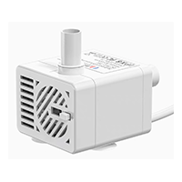
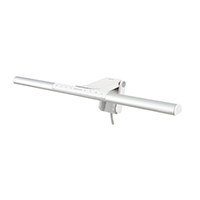
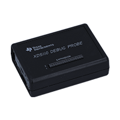
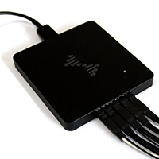
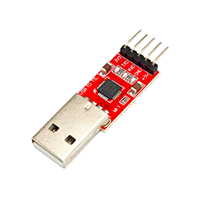
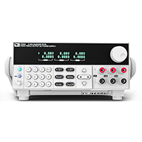
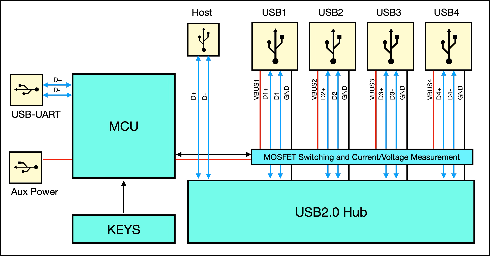
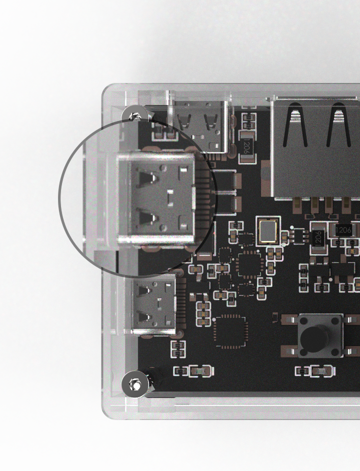
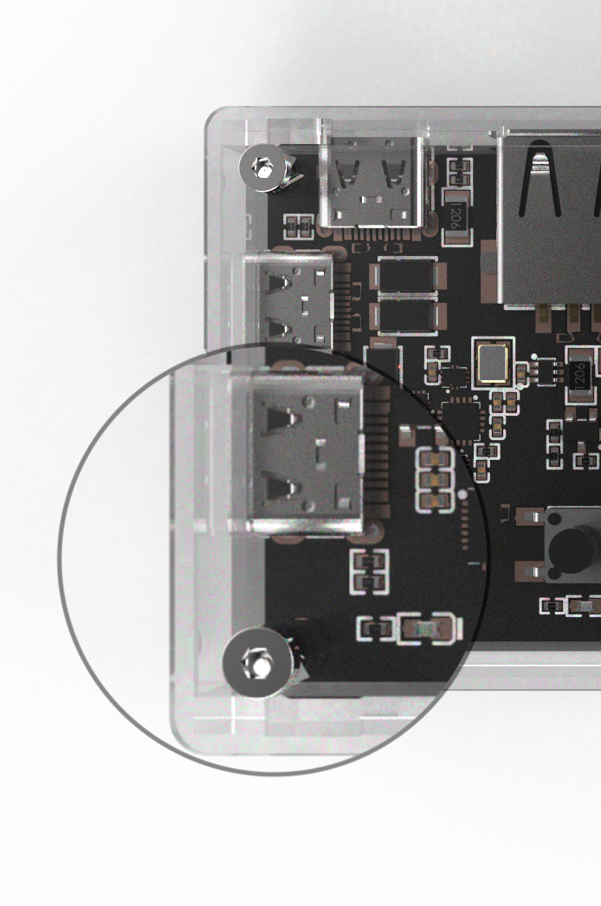

# 智能USB集线器 使用指南

[English Version](./smartusbhub_user_guide.md)


本文档适用型号：`SmartUSBHub_V1.3a`

本文档更新日期：2024年6月19日


## 应用场景

> 智能USB集线器串口版集成了供电与数据通断控制、电压电流采样等功能，可广泛应用于各类研发、测试、生产与设备管理场景，提升系统灵活性与管理效率。

### 嵌入式开发

- 测试机台控制：远程控制Jlink等调试器插拔。
- ECU调试：远程控制USB端口插拔。

### 手机开发

- 驱动测试：模拟充电口插拔，验证接口功能。
- 软件开发与调试：支持安卓ADB、iOS Xcode环境，一键完成设备插拔与编译运行。

### 芯片开发

- USB IP功能验证：模拟物理插拔与异常处理，验证USB接口功能。
- 电气特性调试：监测供电、电流等关键参数，辅助芯片调试。

### 自动化测试系统（ATE）

- 测试DUT上下电与数据连接稳定性。
- 集成电压电流检测，支持DUT电气特性测试。

### 设备功耗与状态监测

- 实时监控接入设备的功耗变化与USB连接状态。

### 无人值守设备维护

- 集中管理树莓派集群或服务器的USB外设，如：dongle。
- 批量控制充电、远程重启，提高运维效率。

### 资产管理

- 控制电子签章、加密狗、税务UKey等硬件资产的连接与授权状态。
- 在金融、政府、数据中心等高安全性场景中，实现USB接口的物理隔离与授权控制。

### 智能办公与会议系统

- 管理会议室USB外设（如摄像头、麦克风）的连接与切换。

### 远程充电与能耗管理

 - 实现共享终端、展览设备等的定时充电与功耗监控。


## 功能特点

- **标准USB 2.0 数据传输**：采用MTT技术的USB 2.0 Hub芯片，每个端口均可达到480Mbps的USB2.0速率，可作为普通USB集线器使用。
- **按键控制**：每个下行通道支持VBUS供电的按键控制和指令控制，实现模拟物理插拔。
- **可编程控制**：使用简单的指令控制集线器，配套python库、C库及demo、提供Windows、Ubuntu、macOS的上位机，快速验证。
- **电源控制**：每个通道均可通过按键或者指令控制其VBUS电源的开关，从而实现模拟物理插拔。
- **USB差分信号线控制**：支持对每个端口的D+/D−数据线进行独立通断控制，可在不断电的前提下断开数据链路，便于调试与测试。

- **电压采集**：每个通道均具备独立电压采集能力，适用于设备状态监测与功耗评估。

- **电流采集**：每个通道均具备独立的电流采集能力，适用于设备状态监测与功耗评估。

- **互锁控制**：可启用互锁控制模式，确保任一时刻仅允许一个通道通电。

- **上电默认状态**：每个通道均可独立设置上电的电源、数据连通的默认状态。

- **断电状态保存**：每个通道均可独立设置是否启用断电状态保存功能。
- **按键功能可配置**：可启用或禁用每个通道的物理按键功能。
- **权限管理**：支持设置访问密码。*后续固件更新支持
- **固件升级**：设备支持一键OTA，持续查询功能更新与Bug修复。
- **多系统兼容**：支持Windows、Linux、macOS，无需额外驱动，使用USB CDC标准串口通信。


## 设备概览


## 连接说明


## 设备接口

- **设备控制端口** 1个：用于收发控制指令，另一端接到主机

- **辅助供电端口** 1个：当下游设备需要更高功率时，将外置供电电源连接至此端口

- **USB上行端口** 1个：用于连接USB主机的端口

- **USB下行端口** 4个：用于连接USB设备 


**[1]按键**：

> **单击**：打开/关闭对应通道
>
> **长按**：[按键1] 3秒：切换工作模式：普通/互锁； 6秒：恢复出厂设置
>
> ​            [按键2] 3秒：启用/关闭上电恢复功能

**[2]通道指示灯**：

> 亮：通道已打开
>
> 灭：通道已关闭

**[3]状态指示灯**：

> 慢闪：普通模式
>
> 快闪：互锁模式

**[4]辅助供电端口**：

> 当下游设备功率超过10W时，请将外置电源连接至该端口。
>
> 该口电源最大输入规格（建议）：30W（5V 6A）不带过流保护。

**[5]设备通信口**：

> 该口用于收发控制指令，另一端接到主机。
>
> 最大输入规格：20W（5V 4A）带防倒灌、过压保护、过流保护。

**[6]USB2.0上行端口**：

> 该口具备供电与数据传输功能，可用于连接USB主机设备，如电脑
>
> 最大输入规格：20W（5V 4A）带防倒灌、过压保护、过流保护。

**[7]USB2.0下行端口**：

> USB-A接口，具备供电数据传输功能，用于连接USB设备
>
> 每个口电源最大输出规格：20W（5V 4A）
>

> [!NOTE]
>
> 连接 **USB2.0上行端口[6]** 到主机以实现数据传输，连接 **设备通信口[5]** 以实现指令控制。
>
> 也就是说，如果需要数据传输且通过指令控制，请将上述两个接口都连接到同一主机。
>
> 

## 系统兼容性

本设备使用标准USB CDC，免驱动。已验证以下系统版本：

- Windows 10、11 或更新版本。
- macOS 10.9 或更新版本。
- Linux 发行版，如Ubuntu。
- 其他X86、AMD64、ARM64架构兼容，如Apple Silicon平台、Windows on ARM平台。

> [!NOTE]
>
> 对于<u>Windows7</u>及之前版本的Windows操作系统，需安装驱动，驱动存放在为`windows7_xp_driver`文件夹中。


## USB兼容性

> 本设备遵循USB2.0协议，上行端口支持USB2.0高速和全速，下行端口支持USB2.0高速480Mbps、全速12Mbps和低速1.5Mbps，向下兼容USB1.1协议规范。
>
> 支持高性能MTT模式（4个TT各对应1个端口，并发处理），为每个端口提供独立TT实现满带宽并发传输，总带宽是STT的4倍。

**可连接所有USB接入的设备，不挑设备**。

### 常用连接设备


| 已验证过的设备                                               | 名称                                        |
| ------------------------------------------------------------ | ------------------------------------------- |
|  | 键盘、鼠标等输入设备                        |
|  | U盘                                         |
|  | 移动硬盘                                    |
|  | CA证书锁、数字签章设备                      |
|  | iPhone                                      |
|    | iPad                                        |
|      | 其他智能手机、平板                          |
|      | USB摄像头 / 麦克风 / 音频卡                 |
|  | 各类 USB CDC 类产品（如工业设备、打印设备） |


### 需要 USB 供电的模块或整机

> 集线器均支持电流消耗小于4A的用电设备。

| 已验证过的设备                                               | 名称                            |
| ------------------------------------------------------------ | ------------------------------- |
|      | USB风扇                         |
|    | 水泵                            |
|  | 小米屏幕挂灯、明基ScreenBar系列 |
|      | USB灯带                         |
|  | USB音箱                         |


### 开发工具类设备

| 已验证过的设备                                               | 名称                   |
| ------------------------------------------------------------ | ---------------------- |
|  | Segger J-Link          |
|  | ST-Link                |
|  | XDS-110                |
|  | XDS-100                |
|  | DAP-LINK               |
|  | USB转CAN               |
|  | 逻辑分析仪             |
|  | USB串口桥              |
|  | USB加密狗              |
|  | 各类开发板、研发原型机 |
|  | 树莓派                 |
|  | 带USB接口的仪器        |

> [!WARNING]
>
> 不支持快充协议，连接手机、平板设备的充电电流等同于直接接到电脑上。

------


## 设备参数

### 主要功能

- 4口USB2.0集线器

- 可通过按键控制对应下行接口的电源通断

- 指令控制指定下行接口的电源、数据信号通断

- 互锁模式，同一时刻只打开一路下行接口

- 每路下行接口电压、电流采集


### 尺寸

10.6x4.6x1.46 CM（长x宽x高）


### 电气参数

- **输入电压**：DC 5V

- **输入电流**（最大）：16A

- **输出电流**：每路最大4A

- **控制方式**：按键控制、指令控制

- **供电方式**：主机取电、辅助供电接口取电


### 接口

- **控制接口**：USB（非TTL信号，内部已经转换为USB串口）

- **上行接口**：1个USB-C接口

- **下行接口**：4个USB-A接口

- **辅助供电接口**：1个USB-C接口


### 保护功能

- **过流保护**：上行接口、指令接口、下行接口每路均带4A自恢复保险；辅助供电口无过流保护

- **过压保护**：上行接口、指令接口带过压保护

- **防电流倒灌**：上行接口、指令接口、辅助供电接口带过压保护；下行接口无倒灌保护

- **静电保护**：关键接口均带ESD静电防护


## 设备框图




## **灯语**

**设备最左侧有一颗指示灯**


**灯语如下**：

| **闪烁规律**       | **含义**         |
| ------------------ | ---------------- |
| 0.5秒亮，0.5秒灭   | 普通工作模式     |
| 0.25秒亮，0.25秒灭 | 通道互锁工作模式 |
| 叠加熄灭           | 接收到控制命令帧 |


## **按键**

**设备有4个按键，分别对应4个USB-A通道的控制，以下按键有特殊功能**：

| **操作**           | **功能**                                  | **默认状态** |
| ------------------ | ----------------------------------------- | ------------ |
| 按键1 先按住再上电 | 进入固件升级模式                          |              |
| 按键1 长按6秒以上  | 恢复出厂设置                              |              |
| 按键1 长按3秒以上  | 切换工作模式：普通/互锁，断电仍然有效。   | 普通模式     |
| 按键2 长按3秒以上  | 启用/禁用断电状态保存功能（记忆通道状态） | 不保存       |


## **指令集**

**设备通过简易的请求-响应通信协议进行交互控制，有以下命令**：

| **功能分类**           | **指令码** | **描述说明**                   |
| :--------------------- | ---------- | ------------------------------ |
| 控制通道电源开关       | 0x01       | 控制指定通道的VBUS供电状态     |
| 查询通道电源状态       | 0x00       | 查询通道当前VBUS供电是否开启   |
| 控制互锁模式下电源开关 | 0x02       | 通道互锁下，仅允许一路通道开启 |
| 查询电压采样           | 0x03       | 查询通道VBUS电压值（单位：mV） |
| 查询电流采样           | 0x04       | 查询通道电流值（单位：mA）     |
| 控制USB差分信号线开关  | 0x05       | 控制D+/D−是否连通              |
| 查询USB差分线状态      | 0x08       | 查询D+/D−当前开关状态          |
| 设置按键控制权限       | 0x09       | 使能或禁用按键控制功能         |
| 查询按键控制权限       | 0x0A       | 查询当前是否启用按键控制       |
| 设置电源默认状态       | 0x0B       | 配置上电后VBUS默认开启/关闭    |
| 查询电源默认状态       | 0x0C       | 查询通道电源默认状态           |
| 设置数据连通的默认状态 | 0x0D       | 配置D+/D−默认开关状态          |
| 查询数据连通的默认状态 | 0x0E       | 查询D+/D−默认状态              |
| 设置断电状态保存       | 0x0F       | 开启/关闭通道状态记忆          |
| 查询断电保存状态       | 0x10       | 查询是否启用断电状态保存功能   |
| 设置工作模式           | 0x06       | 切换普通/互锁模式              |
| 查询工作模式           | 0x07       | 查询当前工作模式               |
| 恢复出厂设置           | 0xFC       | 恢复出厂设置                   |
| 查询固件版本号         | 0xFD       | 查询设备固件版本               |
| 查询硬件版本号         | 0xFE       | 查询当前硬件版本               |

**查询、控制、互锁、设置命令的协议格式如下**：

| **帧头1** | **帧头2** | **CMD**          | **通道号**            | **通道值**  | **附加值**      | **SUM8 校验和** |
| ----- | ----- | ---------------- | --------------------- | ----------- | --------------- | ----------- |
| **0x55** | **0x5A** | **[0x01 0x02 0x03]** | **[0x01 0x02 0x04 0x08]** | **[0x00 0x01]** | ***该字节视指令是否携带** | **CMD+CH+data[...]** |

**读取通道电压、电流的协议格式如下**：

| **帧头1** | **帧头2** | **CMD**              | **通道号**                | **数值 [15:8]** | **数值 [7:0]** | **SUM8 校验和** |
| --------- | --------- | -------------------- | ------------------------- | --------------- | -------------- | --------------- |
| **0x55**  | **0x5A**  | **[0x01 0x02 0x03]** | **[0x01 0x02 0x04 0x08]** | **MSB**         | **LSB**        | **CMD+CH+VAL**  |


## **命令示例**

> [!NOTE]
>
> - **以下所有数据内容均为16进制。**
> - **通道值的取值为`Channel_e`，<u>并非通道数字</u>，在控制和查询命令集中可用位或批量控制和查询；若设备处于互锁模式，<u>则只能使用互锁控制命令[0x02]，按位与无效</u>。**
> - **发送的帧格式或错误命令将不会响应。**
> - **按键按下时将会上报当前按下的通道状态[0x00]。**
> - **在资料包中的uart_tool中，有串口助手便于快速上手。**
> - **提供python控制库[smartusbhub]("https://github.com/MrzhangF1ghter/smartusbhub")**
> - **下文将`USB下行接口`称为`通道`。**

**通道值**：

```c
typedef enum
{
    CH1 = 0x01,
    CH2 = 0x02,
    CH3 = 0x04,
    CH4 = 0x08, 
}Channel_e;

```
> [!NOTE]
>
> **设备通信参数**：
>
> - **波特率：115200 - 921600** 默认：`115200`
> - **数据位：8**
> - **校验位：无**
> - **停止位：1**
>
> **设备名称**：
>
> - **Windows平台:  `COMx`**
> - **Linux平台: `/dev/ttyACMx`**
> - **macOS平台: `/dev/cu.usbmodemx`**


------


### **控制通道电源开关(CMD:0x01)**

> [!NOTE]
>
> **若设备处于互锁模式下，则控制指令(CMD:0x01)无效，需要使用互锁控制命令(CMD:0x02)控制；**
>
> **若处于互锁模式下，发送控制指令，将会返回指令无效帧**：
>
> **指令无效**：
>
> ```
> 55 5A 01 FF FF FF 
> ```

#### **打开通道1电源**

**命令**：

```
55 5A 01 01 01 03
```

**返回**：

```
55 5A 01 01 01 03
```

#### **关闭通道1电源**

**命令**：

```
55 5A 01 01 00 02
```

**返回**：

```
55 5A 01 01 00 02
```

#### **打开通道2电源**

**命令**：

```
55 5A 01 02 01 04
```

**返回**：

```
55 5A 01 02 01 04
```

#### **关闭通道2电源**

**命令**：

```
55 5A 01 02 00 03
```

**返回**：

```
55 5A 01 02 00 03
```

#### **打开通道3电源**

**命令**：

```
55 5A 01 04 01 06
```

**返回**：

```
55 5A 01 04 01 06
```

#### **关闭通道3电源**

**命令**：

```
55 5A 01 04 00 05
```

**返回**：

```
55 5A 01 04 00 05
```

#### **打开通道4电源**

**命令**：

```
55 5A 01 08 01 0A
```

**返回**：

```
55 5A 01 08 01 0A
```

#### **关闭通道4电源**

**命令**：

```
55 5A 01 08 00 09
```

**返回**：

```
55 5A 01 08 00 09
```

#### **组合控制示例**

#### **打开通道1和通道3电源**

**命令**：

```
55 5A 01 05 01 07
```

**返回**：

```
55 5A 01 05 01 07
```

#### **关闭通道1和通道3电源**

**命令**：

```
55 5A 01 05 00 06
```

**返回**：

```
55 5A 01 05 00 06
```

#### **打开所有通道电源**

**命令**：

```
55 5A 01 0F 01 11
```

**返回**：

```
55 5A 01 0F 01 11
```

#### **关闭所有通道电源**

**命令**：

```
55 5A 01 0F 00 10
```

**返回**：

```
55 5A 01 0F 00 10
```


### **查询通道电源开关值(CMD:0x00)**

#### **查询通道1电源的开关值**

**命令**：

```
55 5A 00 01 00 01
```

**返回**：

**如果通道1电源关闭**：

```
55 5A 00 01 00 01
```

**如果通道1电源打开**：

```
55 5A 00 01 01 02
```

#### **查询通道2电源的开关值**

**命令**：

```
55 5A 00 02 00 02
```

**返回**：

**如果通道2电源关闭**：

```
55 5A 00 02 00 02
```

**如果通道2电源打开**：

```
55 5A 00 02 01 03
```

#### **查询通道3电源的开关值**

**命令**：

```
55 5A 00 04 00 04
```

**返回**：

**如果通道3电源关闭**：

```
55 5A 00 04 00 04
```

**如果通道3电源打开**：

```
55 5A 00 04 01 05
```

#### **查询通道4电源的开关值**

**命令**：

```
55 5A 00 08 00 08
```

**返回**：

**如果通道4电源关闭**：

```
55 5A 00 08 00 08
```

**如果通道4电源打开**：

```
55 5A 00 08 01 09
```

#### **组合控制示例**：

#### **查询所有通道的电源开关值**

**命令**：

```
55 5A 00 0F 00 0F
```

**返回**：

```
55 5A 00 01 01 02 
55 5A 00 02 00 02 
55 5A 00 04 00 04 
55 5A 00 08 01 09 
```

- **通道1电源：打开**

- **通道2电源：关闭** 

- **通道3电源：关闭** 

- **通道4电源：打开**


### **控制通道USB 差分信号线开关 (CMD:0x05)**

**设备可控制指定通道的USB差分对（D+ D-）的通断，从而满足保持供电但断开数据的应用场景。**

> [!NOTE]
>
> 1. **设备默认每个通道的USB 差分信号线信号是连通的，除非用户发送控制通道差分信号线开关指令(CMD:0x05)手动切断。**
> 2. **如果启用断电状态保存，差分信号线开关状态将记忆。**

#### **连通通道1数据**

**命令**：

```
55 5A 05 01 01 07
```

**返回**：

```
55 5A 05 01 01 07
```

#### **断开通道1数据**

**命令**：

```
55 5A 05 01 00 06
```

**返回**：

```
55 5A 05 01 00 06
```

#### **连通通道2数据**

**命令**：

```
55 5A 05 02 01 08
```

**返回**：

```
55 5A 05 02 01 08
```

#### **断开通道2数据**

**命令**：

```
55 5A 05 02 00 07
```

**返回**：

```
55 5A 05 02 00 07
```

#### **连通通道3数据**

**命令**：

```
55 5A 05 04 01 0A
```

**返回**：

```
55 5A 05 04 01 0A
```

#### **断开通道3数据**

**命令**：

```
55 5A 05 04 00 09
```

**返回**：

```
55 5A 05 04 00 09
```

#### **连通通道4数据**

**命令**：

```
55 5A 05 08 01 0E
```

**返回**：

```
55 5A 05 08 01 0E
```

#### **断开通道4数据**

**命令**：

```
55 5A 05 08 00 0D
```

**返回**：

```
55 5A 05 08 00 0D
```

#### **组合控制示例**：

#### **连通所有通道数据**

**命令**：

```
55 5A 05 0F 01 15
```

**返回**：

```
55 5A 05 0F 01 15
```

#### **断开所有通道数据**

**命令**：

```
55 5A 05 0F 00 14
```

**返回**：

```
55 5A 05 0F 00 14
```


### **查询通道USB 差分信号线开关值(CMD:0x08)**

#### **查询通道1数据的连通状态**

**命令**：

```
55 5A 08 01 00 09
```

**返回**：

**如果通道1数据断开**：

```
55 5A 08 01 00 09
```

**如果通道1数据连通**：

```
55 5A 08 01 01 0A
```

#### **查询通道2数据的连通状态**

**命令**：

```
55 5A 08 02 00 0A
```

**返回**：

**如果通道2数据断开**：

```
55 5A 08 02 00 0A
```

**如果通道2数据连通**：

```
55 5A 08 02 01 0B
```

#### **查询通道3数据的连通状态**

**命令**：

```
55 5A 08 04 00 0C
```

**返回**：

**如果通道3数据断开**：

```
55 5A 08 04 00 0C
```

**如果通道3数据连通**：

```
55 5A 08 04 01 0D
```

#### **查询通道4数据的连通状态**

**命令**：

```
55 5A 08 08 00 10
```

**返回**：

**如果通道4数据断开**：

```
55 5A 08 08 00 10
```

**如果通道4数据连通**：

```
55 5A 08 08 01 11
```

#### **组合控制示例**：

#### **查询所有通道的数据连通状态**

**命令**：

```
55 5A 08 0F 00 17
```

**返回**：

```
55 5A 08 01 01 0A
55 5A 08 02 01 0B
55 5A 08 04 01 0D
55 5A 08 08 01 11 
```

- **通道1数据：连通**

- **通道2数据：连通** 

- **通道3数据：连通** 

- **通道4数据：连通**


### **控制互锁模式下电源开关(CMD:0x02)**

**控制真值表**：

| 通道1    | 通道2    | 通道3    | 通道4    |
| -------- | -------- | -------- | -------- |
| 关闭     | 关闭     | 关闭     | 关闭     |
| **打开** | 关闭     | 关闭     | 关闭     |
| 关闭     | **打开** | 关闭     | 关闭     |
| 关闭     | 关闭     | **打开** | 关闭     |
| 关闭     | 关闭     | 关闭     | **打开** |


#### **打开通道1电源，其余通道关闭**

**命令**：

```
55 5A 02 01 01 04
```

**返回**：

```
55 5A 02 01 01 04
```

#### **打开通道2电源，其余通道关闭**

**命令**：

```
55 5A 02 02 01 05
```

**返回**：

```
55 5A 02 02 01 05
```

#### **打开通道3电源，其余通道关闭**

**命令**：

```
55 5A 02 04 01 07 
```

**返回**：

```
55 5A 02 04 01 07 
```

#### **打开通道4电源，其余通道关闭**

**命令**：

```
55 5A 02 08 01 0B
```

**返回**：

```
55 5A 02 08 01 0B
```


#### **关闭所有通道**

**命令**：

```
55 5A 02 0F 01 12
```

**返回**：

```
55 5A 02 0F 01 12
```


### **查询通道电压(CMD:0x03)**

**设备可测量每一路通道输出端(VBUS)的电压值，可用于判断总线是否正常。**

***电压分辨率为0.1V***

#### **查询通道1的电压值**：

**命令**：

```
55 5A 03 01 00 04
```

**返回**：

```
55 5A 03 01 13 56 6D
```

**通道1电压值为：0x1356 = 4950mv (通道打开)**

#### **查询通道2的电压值**：

**命令**：

```
55 5A 03 02 00 05
```

**返回**：

```
55 5A 03 02 00 0C 11 
```

**通道2电压值为：0x000C = 12mv (通道关闭)**

#### **查询通道3的电压值**：

**命令**：

```
55 5A 03 04 00 07 
```

**返回**：

```
55 5A 03 04 00 09 10
```

**通道3电压值为：0x0009  = 9mv (通道关闭)**

#### **查询通道4的电压值**：

**命令**：

```
55 5A 03 08 00 0B  
```

**返回**：

```
55 5A 03 08 00 08 13
```

**通道4电压值为：0x0008  = 8mv (通道关闭)**


### **查询通道电流(CMD:0x04)**

**设备可测量每一路通道的电流值，可用于判断设备工作状态。**
***电流分辨率为0.1A***

#### **查询通道1的电流值**：

**命令**：

```
55 5A 04 01 00 05  
```

**返回**：

```
55 5A 04 01 01 29 2F
```

**通道1电流值为：0x0129  = 297ma**

#### **查询通道2的电流值**：

**命令**：

```
55 5A 04 02 00 06  
```

**返回**：

```
55 5A 04 02 00 00 06
```

**通道2电流值为：0x0000  = 0ma** 

#### **查询通道3的电流值**：

**命令**：

```
55 5A 04 04 00 08  
```

**返回**：

```
55 5A 04 04 00 00 08
```

**通道3电流值为：0x0000  = 0ma** 

#### **查询通道4的电流值**：

**命令**：

```
55 5A 04 08 00 0C 
```

**返回**：

```
55 5A 04 08 00 00 0C
```

**通道4电流值为：0x0000  = 0ma** 


### **设置按键控制权限(CMD:0x09)**

> [!NOTE]
>
> 1. **设备默认能通过按键控制对应通道。**
>
> 2. **该配置影响范围为所有按键及通道。**
>
> 3. **长按功能不受影响。**
>
> 4. **该指令断电仍然保存。**


#### **禁用通过按键控制**

**命令**：

```
55 5A 09 00 00 09
```

**返回**：

```
55 5A 09 00 00 09
```

#### **启用通过按键控制**

**命令**：

```
55 5A 09 00 01 0A
```

**返回**：

```
55 5A 09 00 01 0A
```


### **查询按键控制权限(CMD:0x0A)**

**命令**：

```
55 5A 0A 00 00 0A
```

**返回**：

**启用按键控制**

```
55 5A 0A 00 01 0B
```

**关闭按键控制功能**

```
55 5A 0A 00 00 0A
```


### **设置通道电源默认状态(CMD:0x0B)**

> [!NOTE]
>
> - **在系统上电后的通道状态判断中，默认通道状态优先级高于断电状态保存功能。当默认通道状态功能开启时，即使断电状态保存功能也处于开启状态，系统上电后仍将按照默认通道状态决定各通道电源或数据的开启/关闭状态。**
>
> - **当默认通道状态功能关闭时，通道的上电状态将依据断电状态保存功能的设置决定。若断电状态保存功能也处于关闭状态（默认配置），则系统上电后所有通道默认保持关闭状态。**
>
> - **出厂配置默认所有通道的电源都是关闭的。**


#### **设置通道1电源默认状态为打开**


**命令**：

```
55 5A 0B 01 01 01 0E
```

**返回**：

```
55 5A 0B 01 01 01 0E
```


#### **设置通道1电源默认状态为关闭**

**命令**：

```
55 5A 0B 01 01 00 0D
```

**返回**：

```
55 5A 0B 01 01 00 0D
```


#### **设置通道2电源默认状态为打开**


**命令**：

```
55 5A 0B 02 01 01 0F
```

**返回**：

```
55 5A 0B 02 01 01 0F
```


#### **设置通道2电源默认状态为关闭**


**命令**：

```
55 5A 0B 02 01 00 0E
```

**返回**：

```
55 5A 0B 02 01 00 0E
```


#### **设置通道3电源默认状态为打开**


**命令**：

```
55 5A 0B 04 01 01 11
```

**返回**：

```
55 5A 0B 04 01 01 11
```


#### **设置通道3电源默认状态为关闭**


**命令**：

```
55 5A 0B 04 00 00 0F
```

**返回**：

```
55 5A 0B 04 00 00 0F
```


#### **设置通道4电源默认状态为打开**


**命令**：

```
55 5A 0B 08 01 01 15
```

**返回**：

```
55 5A 0B 08 01 01 15
```


#### **设置通道4电源默认状态为关闭**


**命令**：

```
55 5A 0B 08 01 00 14
```

**返回**：

```
55 5A 0B 08 01 00 14
```


#### **设置所有通道电源默认状态为打开**


**命令**：

```
55 5A 0B 0F 01 01 1C
```

**返回**：

```
55 5A 0B 0F 01 01 1C
```


#### **设置所有通道电源默认状态为关闭**


**命令**：

```
55 5A 0B 0F 01 00 1B
```

**返回**：

```
55 5A 0B 0F 01 00 1B
```


#### **禁用通道1电源使用默认状态**

**命令**：

```
55 5A 0B 01 00 00 0C
```

**返回**：

```
55 5A 0B 01 00 00 0C
```


#### **禁用通道2电源使用默认状态**


**命令**：

```
55 5A 0B 02 00 00 0D
```

**返回**：

```
55 5A 0B 02 00 00 0D
```


#### **禁用通道3电源使用默认状态**


**命令**：

```
55 5A 0B 04 00 00 0F
```

**返回**：

```
55 5A 0B 04 00 00 0F
```


#### **禁用通道4电源使用默认状态**


**命令**：

```
55 5A 0B 08 00 00 13
```

**返回**：

```
55 5A 0B 08 00 00 13
```


#### **禁用所有通道电源使用默认状态**


**命令**：

```
55 5A 0B 0F 00 00 1A
```

**返回**：

```
55 5A 0B 0F 00 00 1A
```


### **查询通道电源默认状态(CMD:0x0C)**

#### **查询通道1的电源默认状态**

**命令**：

```
55 5A 0C 01 00 00 0D
```

**返回**：

**默认状态禁用**

```
55 5A 0C 01 00 00 0D
```

**默认关闭**

```
55 5A 0C 01 00 00 0D 
```
**默认开启**

```
55 5A 0C 01 01 01 0F 
```


#### **查询通道2的电源默认状态**

**命令**：

```
55 5A 0C 02 00 00 0E
```

**返回**：

**默认状态禁用**

```
55 5A 0C 02 00 00 0E 
```

**默认关闭**

```
55 5A 0C 02 00 00 0E 
```
**默认开启**

```
55 5A 0C 02 01 01 10
```

#### **查询通道3的电源默认状态**

**命令**：

```
55 5A 0C 04 00 00 10
```

**返回**：

**默认状态禁用**

```
55 5A 0C 04 00 00 10 
```

**默认关闭**

```
55 5A 0C 04 00 00 10 
```
**默认开启**

```
55 5A 0C 04 01 01 12 
```

#### **查询通道4的电源默认状态**

**命令**：

```
55 5A 0C 08 00 00 14
```

**返回**：

**默认状态禁用**

```
55 5A 0C 08 00 00 14 
```

**默认关闭**

```
55 5A 0C 08 00 00 14
```
**默认开启**

```
55 5A 0C 08 01 01 16 
```


#### **查询所有通道的电源默认状态**

**命令**：

```
55 5A 0C 0F 00 00 1B
```

**返回**：

```
55 5A 0C 01 01 01 0F
55 5A 0C 02 01 01 10
55 5A 0C 04 01 01 12
55 5A 0C 08 01 01 16 
```
- **通道1电源: 默认开启**

- **通道2电源: 默认开启**

- **通道3电源: 默认开启**

- **通道4电源: 默认开启**


### **设置通道数据连通的默认状态(CMD:0x0D)**

> [!NOTE]
>
> - **在系统上电后的通道状态判断中，默认通道状态优先级高于断电状态保存功能。当默认通道状态功能开启时，即使断电状态保存功能也处于开启状态，系统上电后仍将按照默认通道状态决定各通道电源或数据的开启/关闭状态。**
>
> - **当默认通道状态功能关闭时，通道的上电状态将依据断电状态保存功能的设置决定。若断电状态保存功能也处于关闭状态（默认配置），则系统上电后所有通道默认保持关闭状态。**
> - **出厂配置默认所有通道的数据都是联通的。**


#### **设置通道1数据连通的默认状态为连接**


**命令**：

```
55 5A 0D 01 01 01 10
```

**返回**：

```
55 5A 0D 01 01 01 10
```


#### **设置通道1数据连通的默认状态为断开**


**命令**：

```
55 5A 0D 01 01 00 0F
```

**返回**：

```
55 5A 0D 01 01 00 0F
```


#### **设置通道2数据连通的默认状态为连接**


**命令**：

```
55 5A 0D 02 01 01 11
```

**返回**：

```
55 5A 0D 02 01 01 11
```


#### **设置通道2数据连通的默认状态为断开**


**命令**：

```
55 5A 0D 02 01 00 10
```

**返回**：

```
55 5A 0D 02 01 00 10
```


#### **设置通道3数据连通的默认状态为连接**


**命令**：

```
55 5A 0D 04 01 01 13
```

**返回**：

```
55 5A 0D 04 01 01 13
```


#### **设置通道3数据连通的默认状态为断开**


**命令**：

```
55 5A 0D 04 01 00 12
```

**返回**：

```
55 5A 0D 04 01 00 12
```


#### **设置通道4数据连通的默认状态为连接**


**命令**：

```
55 5A 0D 08 01 01 17
```

**返回**：

```
55 5A 0D 08 01 01 17
```


#### **设置通道4数据连通的默认状态为断开**


**命令**：

```
55 5A 0D 08 01 00 16
```

**返回**：

```
55 5A 0D 08 01 00 16
```


#### **设置所有通道数据连通的默认状态为连接**


**命令**：

```
55 5A 0D 0F 01 01 1E
```

**返回**：

```
55 5A 0D 0F 01 01 1E
```


#### **设置所有通道数据连通的默认状态为断开**


**命令**：

```
55 5A 0D 0F 01 00 1D
```

**返回**：

```
55 5A 0D 0F 01 00 1D
```


#### **禁用通道1通道数据使用默认状态**


**命令**：

```
55 5A 0D 01 00 00 0E
```

**返回**：

```
55 5A 0D 01 00 00 0E
```


#### **禁用通道2通道数据连接使用默认状态**


**命令**：

```
55 5A 0D 02 00 00 0F
```

**返回**：

```
55 5A 0D 02 00 00 0F
```


#### **禁用通道3通道数据连接使用默认状态**


**命令**：

```
55 5A 0D 04 00 00 11
```

**返回**：

```
55 5A 0D 04 00 00 11
```


#### **禁用通道4通道数据连接使用默认状态**


**命令**：

```
55 5A 0D 08 00 00 15
```

**返回**：

```
55 5A 0D 08 00 00 15
```


#### **禁用所有通道数据连接使用默认状态**


**命令**：

```
55 5A 0D 0F 00 01 1D
```

**返回**：

```
55 5A 0D 0F 00 01 1D
```


### **查询通道数据连通的默认状态(CMD:0x0E)**

#### **查询通道1数据连通的默认状态**

**命令**：

```
55 5A 0E 01 00 00 0F
```

**返回**：

**默认状态禁用，数据默认连接**：

```
55 5A 0E 01 00 01 10 
```

**默认状态启用，数据默认断开**：

```
55 5A 0E 01 01 00 10
```

**默认状态启用，数据默认连接**：

```
55 5A 0E 01 01 01 11
```

#### **查询通道2数据连通的默认状态**

**命令**：

```
55 5A 0E 02 00 00 10
```

**返回**：

**默认状态禁用，数据默认连接**：

```
55 5A 0E 02 00 01 11 
```

**默认状态启用，数据默认断开**：

```
55 5A 0E 02 01 00 11
```

**默认状态启用，数据默认连接**：

```
55 5A 0E 02 01 01 12 
```

#### **查询通道3数据连通的默认状态**

**命令**：

```
55 5A 0E 04 00 00 12
```

**返回**：

**默认状态禁用，数据默认连接**：

```
55 5A 0E 04 00 01 13
```

**默认状态启用，数据默认断开**：

```
55 5A 0E 04 01 00 13
```

**默认状态启用，数据默认连接**：

```
55 5A 0E 04 01 01 14
```

#### **查询通道4数据连通的默认状态**

**命令**：

```
55 5A 0E 08 00 00 16
```

**返回**：

**默认状态禁用，数据默认连接。**

```
55 5A 0E 08 00 01 17
```

**默认状态启用，数据默认断开**：

```
55 5A 0E 08 01 00 17
```

**默认状态启用，数据默认连接**：

```
55 5A 0E 08 01 01 18
```


#### **查询所有通道数据连通的默认状态**

**命令**：

```
55 5A 0E 0F 00 00 1D
```

**返回**：

- **通道1数据: 默认状态禁用，数据默认连接。**
- **通道2数据: 默认状态禁用，数据默认连接。**
- **通道3数据: 默认状态禁用，数据默认连接。**
- **通道4数据: 默认状态禁用，数据默认连接。**

```
55 5A 0E 01 00 01 10 
55 5A 0E 02 00 01 11 
55 5A 0E 04 00 01 13 
55 5A 0E 08 00 01 17 
```


- **通道1数据: 默认状态启用，数据默认断开。**
- **通道2数据: 默认状态启用，数据默认断开。**
- **通道3数据: 默认状态启用，数据默认断开。**
- **通道4数据: 默认状态启用，数据默认断开。**

```
55 5A 0E 01 01 00 10 
55 5A 0E 02 01 00 11 
55 5A 0E 04 01 00 13 
55 5A 0E 08 01 00 17 
```


### **设置断电状态保存(CMD:0x0F)**

> **[!NOTE]**
>
> **此功能可通过长按按键2开启或者关闭，开启后，将自动保存当前的通道状态，重新上电将会恢复所有通道断电之前的状态**
> 


#### **启用断电状态保存**


**命令**：

```
55 5A 0F 00 01 10
```

**返回**：

```
55 5A 0F 00 01 10
```


#### **关闭断电状态保存**


**命令**：

```
55 5A 0F 00 00 0F
```

**返回**：

```
55 5A 0F 00 00 0F
```


### **查询断电状态保存状态(CMD:0x10)**


**命令**：

```
55 5A 10 00 00 10
```

**返回**：

**断电状态保存启用**

```
55 5A 10 00 01 11
```

**断电状态保存禁用**

```
55 5A 10 00 00 10
```


### **设置工作模式(CMD:0x06)**

> [!NOTE]
>
> **设备两种工作模式**：
>
> 1. **普通模式：该模式每个通道都可任意控制。**
> 2. **互锁模式：该模式下各个通道为互斥状态，同一时刻只有一个通道打开。**
>
> - **该指令断电仍然保存。**
> - **可以通过长按`按键1`3秒以上切换工作模式，可通过指示灯状态确定当前工作模式。**


#### **设置普通模式**

**命令**：

```
55 5A 06 00 00 06
```

**返回**：

```
55 5A 06 00 00 06
```

#### **设置互锁模式**

**命令**：

```
55 5A 06 00 01 07
```

**返回**：

```
55 5A 06 00 01 07
```


### **查询工作模式(CMD:0x07)**

**命令**：

```
55 5A 07 00 00 07
```

**返回**：

**设备处于普通模式下**：

```
55 5A 07 00 00 07
```

**设备处于互锁模式下**：

```
55 5A 07 00 01 08
```


### **恢复出厂设置(CMD:0xFC)**

**命令**：

```
55 5A FC 00 00 FC
```

**返回**：

```
55 5A FC 00 00 FC
```


### **查询固件版本(CMD:0xFD)**

**命令**：

```
55 5A FD 00 00 FD
```

**返回**：

```
55 5A FD 00 0F 0C
```

**固件版本号：15**


### **查询硬件版本(CMD:0xFE)**

**命令**：

```
55 5A FE 00 00 FE
```

**返回**：

```
55 5A FE 00 03 01
```

**硬件版本号：3 / V1.3**


## **术语表**

| **中文术语**           | **英文术语**                         | **说明**                                         |
| ---------------------- | ------------------------------------ | ------------------------------------------------ |
| USB差分信号线（D+/D−） | USB Differential Signal Pair (D+/D−) | USB数据传输的差分对，核心物理信号线              |
| 差分信号线开关         | Differential Pair Switch             | 控制D+/D−的连接状态                              |
| 电源控制               | VBUS Power Control                   | 控制通道的USB供电状态                            |
| 电源开关状态           | Power Switch State                   | 表示当前VBUS供电是否开启                         |
| 通道                   | Channel                              | 集线器的各个下行端口（下游端口）                 |
| USB CDC                | USB Communications Device Class      | 一种将 USB 设备虚拟成串口的标准协议              |
| 通道电压               | Channel Voltage                      | VBUS上的电压采样值（单位：mV）                   |
| 通道电流               | Channel Current                      | 电源输出电流采样值（单位：mA）                   |
| 数据控制               | USB Signal Control                   | 控制D+/D−通断，但保留供电                        |
| 数据开关状态           | Signal Line Switch State             | 当前差分信号是否连通                             |
| 通道互锁模式           | Channel Interlock Mode               | 同一时间仅允许一个通道开启的互斥控制模式         |
| 上电默认状态           | Power-On Default State               | 每通道上电后的初始开关状态                       |
| 默认电源状态           | Default Power State                  | 系统上电后VBUS电源的默认开关值                   |
| 默认数据状态           | Default Signal State                 | 系统上电后D+/D−数据线的默认开关值                |
| 断电状态保存           | Power-Loss State Retention           | 系统掉电前状态是否保存，并在上电后恢复           |
| 按键控制权限           | Button Control Permission            | 是否允许用户通过实体按键控制通道                 |
| 上行端口               | Upstream Port                        | 连接到主机（PC等）的端口                         |
| 下行端口               | Downstream Port                      | 连接到外设（USB设备）的端口                      |
| 指令控制               | Software Command Control             | 通过串口协议下发的控制指令                       |
| 工作模式               | Operation Mode                       | 普通模式 / 互锁模式                              |
| 普通模式               | Normal Mode                          | 每通道独立控制                                   |
| 互锁模式               | Interlock Mode                       | 通道互斥，仅一个端口可同时开启                   |
| 固件版本               | Firmware Version                     | 当前运行的系统版本                               |
| 硬件版本               | Hardware Version                     | 当前使用的硬件电路版本                           |
| 串口通信               | UART Communication                   | 使用USB虚拟串口进行指令传输                      |
| 命令帧/协议帧          | Command Frame / Protocol Frame       | 用于控制的完整通信报文结构                       |
| 快速插拔模拟           | Simulated Hot-Plug                   | 保持供电的前提下控制数据连通，实现热插拔场景模拟 |


## FAQ：

**Q**：已经接入USB数据设备（如U盘），但电脑端无法识别到任何连接的设备？

**A**：需连接`[6]USB2.0上行端口`到电脑上。

 


**Q**:没有找到串口设备

**A**:电脑是否为windows7或更早之前的版本？如果是，请安装legacy driver；检查是否将`[5]设备通信口`连接至主机接口




**Q**:集线器偶尔会跟电脑断开连接

**A**:检查接入的设备功率是否过高？

如果超过电脑USB口的输出功率，则需要将足够功率的5V的电源适配器接到`[4]辅助供电端口`进行额外的供电。




## **笔记:**

**此页为空白页**
