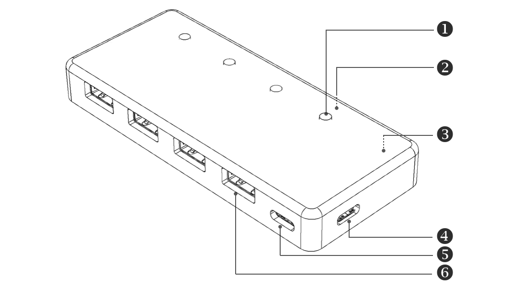
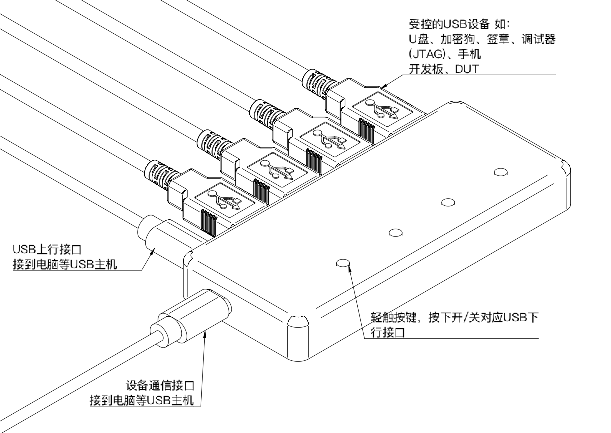

# 智能USB集线器

## 简介

智能USB集线器（SmartUSBHub），是一款可通过串口指令远程控制的4口USB集线器，具备普通USB集线器不具备的端口独立开关控制功能。它在以下领域广泛应用：

### **用途：**

- **远程控制数据传输**
  - 支持通过Python等程序控制各USB端口的电源和数据连接，实现远程插拔设备的功能，如ADB调试、XCode调试和JTAG调试。
  - 内置USB端口电压检测，实时监测电压状态。
- **电子签章/密钥管理**
- 可使用互锁模式，实现同一时刻只有一个USB端口与电脑连接。
- **大功率设备控制**

  - 每个USB端口最大输出20W（5V 4A），足以支持多种高功率设备。
  
  - 可用于控制电池设备的充放电。
  
  - 选配继电器板后，可控制更高电压和功率的设备。

### **设备接口：**

- **按键**4个：用于控制指定USB下行端口的通断

- **设备控制端口** 1个：用于收发控制指令，另一端接到主机

- **USB上行端口** 1个：用于连接USB主机的端口

- **USB下行端口** 4个：用于连接USB设备 

**[1]按键 x4：**

> **单击：**打开/关闭对应通道
>
> **长按：**[按键1] 3秒：切换工作模式：普通/互锁
>
> ​            [按键2] 3秒：启用/关闭上电恢复功能

**[2]通道指示灯 x4：**

> 亮：通道已打开
>
> 灭：通道已关闭

**[3]状态指示灯：**

> 慢闪：普通模式
>
> 快闪：互锁模式

**[4]设备通信口USB-C：**

> 该口用于收发控制指令，另一端接到主机。
>
> 该口电源最大输入规格：50W（5V 10A）

**[5]USB2.0上行端口USB-C：**

> 该口具备供电与数据传输功能，可用于连接USB主机设备，如电脑
>
> 该口电源最大输入规格：50W（5V 10A）

**[6]USB2.0下行端口 x4：**

> USB-A接口，具备供电数据传输功能，用于连接USB设备
>
> 每个口电源最大输出规格：20W（5V 4A）
>
> 总功率不得超过 100W 设备通信口（5V 10A）+USB2.0上行端口USB-C（5V 10A）的 输入总和

### **连接说明：**

## 功能：

设备有两种工作模式，分别是：

 

## **控制说明：**

请阅读[协议文档](https://github.com/MrzhangF1ghter/smartusbhub/wiki/protocol)

## 兼容性：

### **系统兼容性**：

本设备使用标准USB CDC，免驱动。已验证以下系统版本：

- Windows 10、11 或更新版本。

- macOS 10.9 或更新版本。

- Linux 发行版，如Ubuntu22。

- 其他X86、AMD64、ARM64架构兼容，如Apple Silicon平台、Windows on ARM平台。

### **USB设备兼容性：**

本设备遵循USB2.0协议，上行端口支持USB2.0高速和全速，下行端口支持USB2.0高速480Mbps、全速12Mbps和低速1.5Mbps，向下兼容USB1.1协议规范。支持高性能MTT模式（4个TT各对应1个端口，并发处理），为每个端口提供独立TT实现满带宽并发传输，总带宽是STT的4倍。

已验证过的常用设备有：

- 存储设备（U盘、移动硬盘）

- 安卓设备（定时充电、ADB调试）

- iOS设备（定时充电、Xcode调试）

- 加密狗、电子签章（互锁模式）

- 各类USB转串口桥

- J-Link

- DAP-Link

- ST-Link

- XDS110

- USB转CAN
